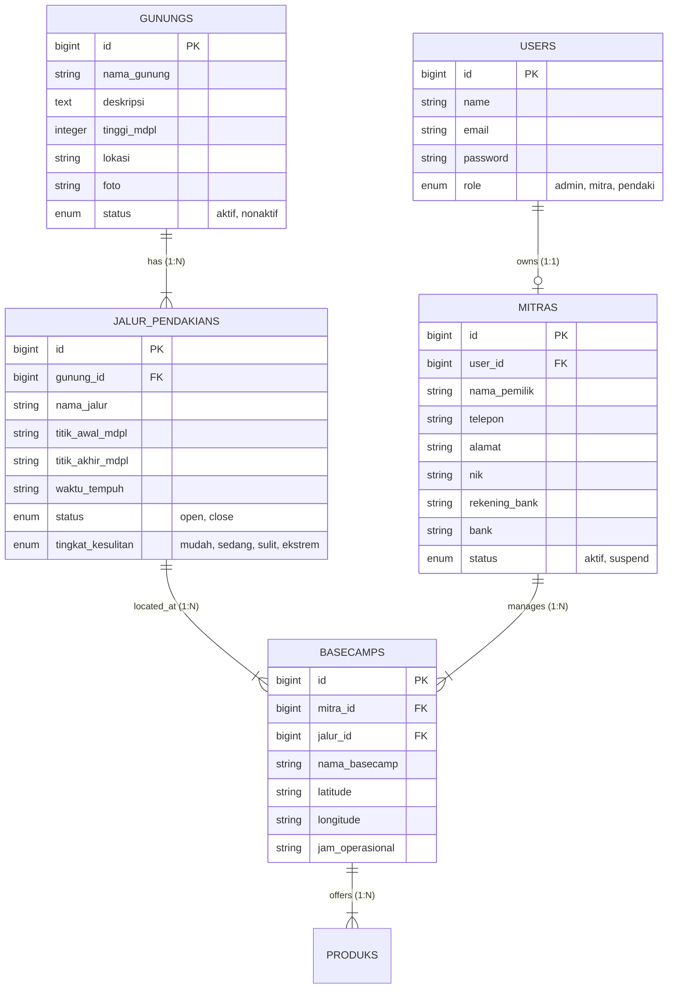

# MODULAR PRD 02: MASTER DATA & BASECAMP MANAGEMENT

Document Version: 1.0.0  
Status: Approved / Implementation Ready  
Target Module: Master Data Gunung, Jalur Pendakian, Basecamp, & Pemetaan Mitra  
Target Path: `docs/prd/modules/02-masterdata-basecamp.md`

---

## GLOBAL API STANDARDIZATION & RESPONSE RULES

Aturan standar ini berlaku secara global di seluruh endpoint modul API Summit v2 (termasuk Auth, KYC, dan Master Data).

### 1. Standard URL Structure
* **API Prefix:** Seluruh API wajib diawali dengan prefix `/api/v1/`.
* **Resource Naming:** Naming convention menggunakan `kebab-case` dan kata benda jamak (*plural nouns*) untuk koleksi resource (misal: `/api/v1/mountains`, `/api/v1/admin/mountains`, `/api/v1/admin/trails`, `/api/v1/admin/basecamps`, `/api/v1/admin/partners`).
* **Parameter Handling:**
  * **Query Params:** Digunakan untuk filtering, sorting, dan paginasi (misal: `?page=1&per_page=15`).
  * **Path Params:** Digunakan untuk mengidentifikasi resource tunggal berdasarkan ID numerik (misal: `/api/v1/mountains/{id}`).

### 2. Standard HTTP Status Codes & Error Handling

| Status Code | Label | Skenario Penggunaan |
| :--- | :--- | :--- |
| `200 OK` | OK | Permintaan berhasil memproses data (Get, Put, Patch, Delete). |
| `201 Created` | Created | Resource baru berhasil dibuat (Post create mountain, trail, basecamp, partner). |
| `400 Bad Request` | Bad Request | Parameter/payload secara logika bisnis tidak valid. |
| `401 Unauthorized` | Unauthorized | Token Sanctum missing, invalid, atau expired. |
| `403 Forbidden` | Forbidden | Pengguna terautentikasi tetapi tidak memiliki hak akses (role mismatch). |
| `404 Not Found` | Not Found | Resource yang diminta tidak ditemukan di database. |
| `422 Unprocessable Entity` | Validation Error | Form request validation Laravel gagal. |
| `500 Internal Server Error` | Server Error | Unhandled exception atau kegagalan internal pada server. |

### 3. Standard Response Schema (JSON Envelope)

#### A. Single Data Success Envelope (`200 OK` / `201 Created`)
```json
{
  "status": "success",
  "message": "Deskripsi pesan sukses yang jelas.",
  "data": {
    "id": 1,
    "nama_gunung": "Gunung Gede",
    "tinggi_mdpl": 2958
  }
}
```

#### B. Paginated Array List Success Envelope (`200 OK`)
```json
{
  "status": "success",
  "message": "Deskripsi daftar data yang diambil.",
  "data": [
    {
      "id": 1,
      "nama_gunung": "Gunung Gede",
      "tinggi_mdpl": 2958,
      "status": "aktif"
    }
  ],
  "meta": {
    "current_page": 1,
    "from": 1,
    "last_page": 3,
    "per_page": 15,
    "to": 15,
    "total": 45
  },
  "links": {
    "first": "http://api.summit.test/api/v1/mountains?page=1",
    "last": "http://api.summit.test/api/v1/mountains?page=3",
    "prev": null,
    "next": "http://api.summit.test/api/v1/mountains?page=2"
  }
}
```

#### C. General Error Response Envelope (`400`, `401`, `403`, `404`, `500`)
```json
{
  "status": "error",
  "message": "Pesan deskripsi error yang ramah pengguna.",
  "error_code": "ERR_RESOURCE_NOT_FOUND"
}
```

#### D. Validation Error Response Envelope (`422 Unprocessable Entity`)
```json
{
  "status": "error",
  "message": "The given data was invalid.",
  "error_code": "ERR_VALIDATION_FAILED",
  "errors": {
    "nama_gunung": [
      "The nama gunung field is required."
    ],
    "tinggi_mdpl": [
      "The tinggi mdpl must be an integer."
    ]
  }
}
```

---

## 1. MODULE OVERVIEW

Modul **Master Data & Basecamp Management** bertanggung jawab atas struktur wilayah, informasi gunung, jalur pendakian, data basecamp operasional, serta keterhubungannya dengan Mitra Pengelola Lokal pada platform **Summit v2**.

Modul ini mendukung dua perspektif utama:
1. **Admin Platform (Management & Governance):** Mengatur profil Gunung, menambah/mengubah/menghapus Jalur Pendakian, mendaftarkan akun dan profil Mitra Pengelola, serta mengasosiasikan Mitra dengan Basecamp dan Jalur spesifik.
2. **Pendaki (Public / Read-Only Discovery):** Menjelajah daftar gunung yang aktif, membaca detail ketinggian (MDPL), lokasi, foto, daftar jalur resmi, tingkat kesulitan, serta estimasi waktu tempuh tanpa memerlukan otentikasi awal (Public Read).

### Technical & UI Stack Implementation Details
* **Web Admin Platform (Management Dashboard)**: Built with **Vue.js 3** + **shadcn-vue** (Tailwind CSS based).
  - Target UI Components: `Data-Table` (list gunung, jalur, basecamp, & mitra), `Dialog` (modal create/edit master data), `Form`, `Select` (pilihan gunung/jalur/mitra), `Input`, `Button`, `Toast` (notifikasi operasi CRUD), `Badge` (status aktif/nonaktif & open/close).
* **Mobile Pendaki App**: Built with **Quasar Framework (Vue 3)** + **Capacitor JS**.
  - Target UI Components: `q-page` (halaman eksplorasi & detail gunung), `q-card` (card katalog gunung/jalur), `q-chip` (badge MDPL & tingkat kesulitan), `q-input` (pencarian gunung), `q-select` (filter provinsi/kesulitan).


## 2. USER STORIES

| ID | Persona | User Story | Prioritas |
| :--- | :--- | :--- | :---: |
| **US-MST-01** | Admin | Sebagai Admin, saya ingin menambah, mengubah, dan menghapus data Gunung (nama, lokasi, MDPL, foto, status), agar katalog gunung pada platform selalu diperbarui. | **P1** |
| **US-MST-02** | Admin | Sebagai Admin, saya ingin mengelola Jalur Pendakian untuk setiap gunung (nama jalur, titik MDPL, waktu tempuh, tingkat kesulitan, status buka/tutup), agar data navigasi lengkap. | **P1** |
| **US-MST-03** | Admin | Sebagai Admin, saya ingin mendaftarkan akun Mitra Pengelola beserta data identitas & rekening bank, agar Mitra memiliki otorisasi operasional. | **P1** |
| **US-MST-04** | Admin | Sebagai Admin, saya ingin mengasosiasikan Mitra dengan Basecamp dan Jalur Pendakian tertentu, agar kuota dan tiket terhubung ke pengelola yang sah. | **P1** |
| **US-MST-05** | Pendaki | Sebagai Pendaki, saya ingin melihat daftar seluruh gunung beserta foto dan lokasi tanpa harus login, agar saya dapat mencari ide pendakian. | **P1** |
| **US-MST-06** | Pendaki | Sebagai Pendaki, saya ingin melihat rincian informasi gunung dan daftar jalur pendakiannya yang tersedia, agar saya dapat memilih rujukan pendakian secara presisi. | **P1** |

---

## 3. FUNCTIONAL REQUIREMENTS (FR) & API CONTRACT MAPPING

| FR ID | Nama Fitur | HTTP Method & URL Endpoint (Refactored) | Request Payload / Headers | Expected Response Schema | Middleware / Guard |
| :--- | :--- | :--- | :--- | :--- | :--- |
| **FR-MST-01** | Public List Gunung | `GET /api/v1/mountains` | **Query:** `page` (int, default: 1) | `200 OK`<br>Paginated List Envelope (`GunungResource`) | Public (None) |
| **FR-MST-02** | Public Detail Gunung | `GET /api/v1/mountains/{id}` | **Path:** `id` (int) | `200 OK`<br>Single Data Envelope (`GunungResource` + `jalurs`) | Public (None) |
| **FR-MST-03** | Create Gunung (Admin) | `POST /api/v1/admin/mountains` | **Headers:** `Authorization: Bearer <token>`<br>**Body (multipart/form-data):**<br>`nama_gunung` (string, req)<br>`deskripsi` (string, req)<br>`tinggi_mdpl` (int, req)<br>`lokasi` (string, req)<br>`foto` (file: image, max 2MB, req)<br>`status` (enum: aktif, nonaktif, req) | `201 Created`<br>Single Data Envelope (`GunungResource`) | `auth:sanctum`, `role:admin` |
| **FR-MST-04** | Update Gunung (Admin) | `POST /api/v1/admin/mountains/{id}` *(dengan `_method=PUT`)* atau `PUT` | **Headers:** `Authorization: Bearer <token>`<br>**Path:** `id` (int)<br>**Body (multipart/form-data):**<br>`_method` = `PUT`<br>`nama_gunung` (string)<br>`deskripsi` (string)<br>`tinggi_mdpl` (int)<br>`lokasi` (string)<br>`foto` (file: image, optional)<br>`status` (string) | `200 OK`<br>Single Data Envelope (`GunungResource`) | `auth:sanctum`, `role:admin` |
| **FR-MST-05** | Delete Gunung (Admin) | `DELETE /api/v1/admin/mountains/{id}` | **Headers:** `Authorization: Bearer <token>`<br>**Path:** `id` (int) | `200 OK`<br>Single Data Envelope (data: null) | `auth:sanctum`, `role:admin` |
| **FR-MST-06** | Create Jalur (Admin) | `POST /api/v1/admin/trails` | **Headers:** `Authorization: Bearer <token>`<br>**Body (JSON):**<br>`gunung_id` (int, req)<br>`nama_jalur` (string, req)<br>`deskripsi` (string)<br>`titik_awal_mdpl` (string)<br>`titik_akhir_mdpl` (string)<br>`waktu_tempuh` (string)<br>`status` (enum: open, close)<br>`panjang_jalur` (string)<br>`tingkat_kesulitan` (enum: mudah, sedang, sulit, ekstrem) | `201 Created`<br>Single Data Envelope (`JalurPendakianResource`) | `auth:sanctum`, `role:admin` |
| **FR-MST-07** | Update Jalur (Admin) | `PUT /api/v1/admin/trails/{id}` | **Headers:** `Authorization: Bearer <token>`<br>**Path:** `id` (int)<br>**Body (JSON):** Payload sama seperti Create Jalur | `200 OK`<br>Single Data Envelope (`JalurPendakianResource`) | `auth:sanctum`, `role:admin` |
| **FR-MST-08** | Delete Jalur (Admin) | `DELETE /api/v1/admin/trails/{id}` | **Headers:** `Authorization: Bearer <token>`<br>**Path:** `id` (int) | `200 OK`<br>Single Data Envelope (data: null) | `auth:sanctum`, `role:admin` |
| **FR-MST-09** | List Basecamp (Admin) | `GET /api/v1/admin/basecamps` | **Headers:** `Authorization: Bearer <token>`<br>**Query:** `page` (int) | `200 OK`<br>Paginated List Envelope (`BasecampResource`) | `auth:sanctum`, `role:admin` |
| **FR-MST-10** | Create Basecamp (Admin) | `POST /api/v1/admin/basecamps` | **Headers:** `Authorization: Bearer <token>`<br>**Body (JSON):**<br>`mitra_id` (int, req)<br>`jalur_id` (int, req)<br>`nama_basecamp` (string, req)<br>`latitude` (string)<br>`longitude` (string)<br>`jam_operasional` (string) | `201 Created`<br>Single Data Envelope (`BasecampResource`) | `auth:sanctum`, `role:admin` |
| **FR-MST-11** | Detail Basecamp (Admin) | `GET /api/v1/admin/basecamps/{id}` | **Headers:** `Authorization: Bearer <token>`<br>**Path:** `id` (int) | `200 OK`<br>Single Data Envelope (`BasecampResource`) | `auth:sanctum`, `role:admin` |
| **FR-MST-12** | Update Basecamp (Admin) | `PUT /api/v1/admin/basecamps/{id}` | **Headers:** `Authorization: Bearer <token>`<br>**Path:** `id` (int)<br>**Body (JSON):** Payload sama seperti Create Basecamp | `200 OK`<br>Single Data Envelope (`BasecampResource`) | `auth:sanctum`, `role:admin` |
| **FR-MST-13** | Delete Basecamp (Admin) | `DELETE /api/v1/admin/basecamps/{id}` | **Headers:** `Authorization: Bearer <token>`<br>**Path:** `id` (int) | `200 OK`<br>Single Data Envelope (data: null) | `auth:sanctum`, `role:admin` |
| **FR-MST-14** | List Mitra (Admin) | `GET /api/v1/admin/partners` | **Headers:** `Authorization: Bearer <token>`<br>**Query:** `page` (int) | `200 OK`<br>Paginated List Envelope (`MitraResource`) | `auth:sanctum`, `role:admin` |
| **FR-MST-15** | Create Mitra (Admin) | `POST /api/v1/admin/partners` | **Headers:** `Authorization: Bearer <token>`<br>**Body (JSON):**<br>`email` (string, req)<br>`password` (string, req)<br>`nama_pemilik` (string, req)<br>`telepon` (string)<br>`alamat` (string)<br>`nik` (string)<br>`rekening_bank` (string)<br>`nama_rekening` (string)<br>`bank` (string)<br>`status` (enum: aktif, suspend) | `201 Created`<br>Single Data Envelope (`MitraResource`) | `auth:sanctum`, `role:admin` |
| **FR-MST-16** | Detail Mitra (Admin) | `GET /api/v1/admin/partners/{id}` | **Headers:** `Authorization: Bearer <token>`<br>**Path:** `id` (int) | `200 OK`<br>Single Data Envelope (`MitraResource`) | `auth:sanctum`, `role:admin` |
| **FR-MST-17** | Update Mitra (Admin) | `PUT /api/v1/admin/partners/{id}` | **Headers:** `Authorization: Bearer <token>`<br>**Path:** `id` (int)<br>**Body (JSON):** Payload update mitra | `200 OK`<br>Single Data Envelope (`MitraResource`) | `auth:sanctum`, `role:admin` |
| **FR-MST-18** | Delete Mitra (Admin) | `DELETE /api/v1/admin/partners/{id}` | **Headers:** `Authorization: Bearer <token>`<br>**Path:** `id` (int) | `200 OK`<br>Single Data Envelope (data: null) | `auth:sanctum`, `role:admin` |

---

## 4. DATABASE & RELATION REFERENCE

Visualisasi keterhubungan relasi tabel pada database PostgreSQL untuk modul Master Data & Basecamp:



---

## 5. NON-FUNCTIONAL REQUIREMENTS (NFR)

1. **Caching Strategy (Public Master Data):**
   * Data public `GET /api/v1/mountains` dan `GET /api/v1/mountains/{id}` di-cache menggunakan Redis / Laravel Cache dengan Time-To-Live (TTL) **1 jam (3600 detik)**.
   * Cache otomatis dibersihkan (*invalidated*) ketika Admin melakukan aksi Create, Update, atau Delete pada Gunung atau Jalur.
2. **Database Indexing:**
   * Wajib dipasang indeks pada kolom `gunung_id` pada tabel `jalur_pendakians`.
   * Wajib dipasang indeks pada kolom `mitra_id` dan `jalur_id` pada tabel `basecamps`.
   * Indexing pada kolom `status` (`gunungs`, `jalur_pendakians`) untuk mempercepat query filtering.
3. **Public Media Assets:**
   * Foto gunung disimpan di public storage disk (`Storage::disk('public')`) dan diakses melalui CDN/Symlink URL publik yang di-optimize (WebP/JPEG max 2MB).
4. **API Latency Target:**
   * Public mountain listing & detail (cached) response latency P95 < **150 ms**.

---

## 6. EDGE CASES & ERROR HANDLING

1. **Penghapusan Gunung Yang Memiliki Jalur Active:**
   * Jika Admin mencoba menghapus Gunung (`DELETE /api/v1/admin/mountains/{id}`) yang memiliki relasi `JalurPendakian`, sistem akan mencegah hard-delete atau menggunakan Foreign Key restriction dan mengembalikan `400 Bad Request` dengan pesan error yang memberitahu bahwa jalur terkait harus dihapus/dipindahkan lebih dahulu.
2. **Koordinat Latitude/Longitude Invalid:**
   * Pengisian koordinat basecamp di luar format desimal standar mengembalikan status `422 Unprocessable Entity`.
3. **Upload Foto Gunung Format Non-Gambar:**
   * Upload berkas selain JPG/PNG/WebP atau ukuran > 2MB ditolak oleh validator dengan status `422 Unprocessable Entity`.
4. **Pemasangan Jalur Ke Gunung Yang Tidak Ada:**
   * Pengisian `gunung_id` yang tidak terdaftar saat membuat jalur mengembalikan `422 Unprocessable Entity` (exists rule failure).

---

## 7. SCOPE BOUNDARY

### In-Scope (v1.0 - Core Release)
* CRUD Master Data Gunung oleh Admin.
* CRUD Master Data Jalur Pendakian oleh Admin.
* CRUD Master Data Basecamp & Pemetaan ke Mitra/Jalur oleh Admin.
* CRUD Profil Mitra & User Account oleh Admin.
* Public Read-Only Endpoint Listing & Detail Gunung/Jalur untuk Pendaki.
* Caching Redis/Laravel Cache untuk Public Master Data.

### Out-of-Scope (Fase / Version Berikutnya)
* Peta Interaktif GIS 3D Topografi Ketinggian Gunung.
* Integrasi Weather Forecast Live API (BMKG API) pada detail gunung.
* Geofencing automatic check-in basecamp berbasis GPS HP Pendaki.
