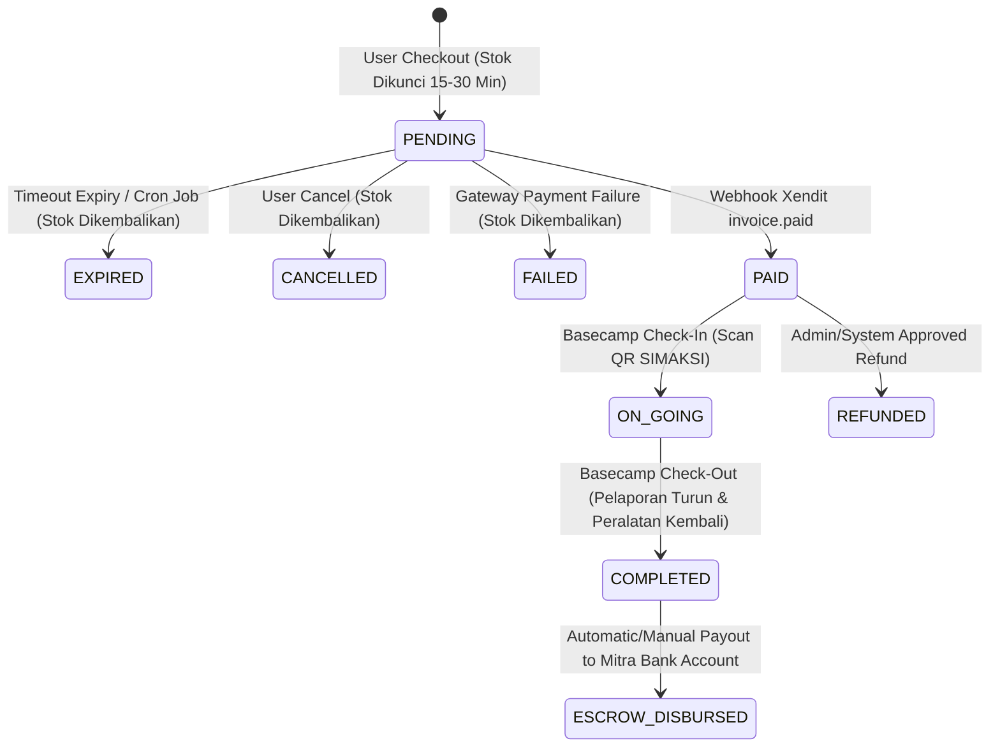

# MODULAR PRD 03: PEMESANAN (ORDER), TRANSAKSI, DAN PELACAKAN STATUS PESANAN

Document Version: 1.0.0  
Status: Approved / Implementation Ready  
Target Module: Pemesanan (Order Header & Line Items), Transaksi Gateway Xendit, Pelacakan Status Operasional (Check-In/Out Basecamp), & Escrow Payout  
Target Path: `docs/prd/modules/03-pemesanan-transaksi-pelacakan.md`

---

## GLOBAL API STANDARDIZATION & RESPONSE RULES

Aturan standar ini berlaku secara global di seluruh endpoint modul API Summit v2.

### 1. Standard URL Structure
* **API Prefix:** Seluruh API wajib diawali dengan prefix `/api/v1/`.
* **Resource Naming:** Naming convention menggunakan `kebab-case` dan kata benda jamak (*plural nouns*) untuk koleksi resource (misal: `/api/v1/orders`, `/api/v1/payments/webhook/xendit`, `/api/v1/basecamp/orders`, `/api/v1/admin/disbursements`).
* **Parameter Handling:**
  * **Query Params:** Digunakan untuk filtering, sorting, dan paginasi (misal: `?status=paid&page=1&per_page=15`).
  * **Path Params:** Digunakan untuk mengidentifikasi resource tunggal berdasarkan ID / Invoice string (misal: `/api/v1/orders/{invoice}`).

### 2. Standard HTTP Status Codes & Error Handling

| Status Code | Label | Skenario Penggunaan |
| :--- | :--- | :--- |
| `200 OK` | OK | Permintaan berhasil memproses data (Get, Put, Patch, Delete, Action Check-in). |
| `201 Created` | Created | Resource baru berhasil dibuat (Post create order / checkout invoice). |
| `400 Bad Request` | Bad Request | Logika bisnis tidak valid (Stok/kuota habis, pesanan sudah expired/paid). |
| `401 Unauthorized` | Unauthorized | Token Sanctum missing, invalid, atau expired. |
| `403 Forbidden` | Forbidden | Pengguna terautentikasi tetapi tidak memiliki hak akses (bukan pemilik pesanan / lain basecamp). |
| `404 Not Found` | Not Found | Invoice / pesanan tidak ditemukan di database. |
| `422 Unprocessable Entity` | Validation Error | Form request validation Laravel gagal (parameter input missing/invalid format). |
| `500 Internal Server Error` | Server Error | Unhandled exception atau kegagalan internal pada server/payment gateway. |

### 3. Standard Response Schema (JSON Envelope)

#### A. Single Data Success Envelope (`200 OK` / `201 Created`)
```json
{
  "status": "success",
  "message": "Deskripsi pesan sukses yang jelas.",
  "data": {
    "invoice": "INV/20260803/0001",
    "status": "pending",
    "total_bayar": 155000.00
  }
}
```

#### B. Paginated Array List Success Envelope (`200 OK`)
```json
{
  "status": "success",
  "message": "Daftar pesanan berhasil diambil.",
  "data": [
    {
      "invoice": "INV/20260803/0001",
      "status": "paid",
      "total_bayar": 155000.00
    }
  ],
  "meta": {
    "current_page": 1,
    "from": 1,
    "last_page": 1,
    "per_page": 15,
    "to": 1,
    "total": 1
  },
  "links": {
    "first": "http://api.summit.test/api/v1/orders?page=1",
    "last": "http://api.summit.test/api/v1/orders?page=1",
    "prev": null,
    "next": null
  }
}
```

#### C. General Error Response Envelope (`400`, `401`, `403`, `404`, `500`)
```json
{
  "status": "error",
  "message": "Quota pendakian untuk tanggal ini sudah penuh.",
  "error_code": "ERR_QUOTA_EXHAUSTED"
}
```

#### D. Validation Error Response Envelope (`422 Unprocessable Entity`)
```json
{
  "status": "error",
  "message": "The given data was invalid.",
  "error_code": "ERR_VALIDATION_FAILED",
  "errors": {
    "tanggal_booking": [
      "The tanggal booking field is required."
    ],
    "items": [
      "The items field must contain at least 1 item."
    ]
  }
}
```

---

## MODUL OVERVIEW & RUANG LINGKUP

Modul 03 ini mengelola seluruh siklus pemesanan pada aplikasi marketplace tiket pendakian gunung `backend/`. Lingkup utamanya meliputi:

1. **Order Creation & Bundling**: Memungkinkan 1 invoice menampung Tiket Simaksi, Alat Rental, Jasa Porter/Guide, dan item merchandise/kuliner dalam 1 transaksi.
2. **Proteksi Concurrency Stok**: Penguncian stok (`lockForUpdate`) untuk menghindari overbooking tiket dan peralatan saat checkout `PENDING`.
3. **Gateway Pembayaran (Xendit)**: Integrasi pembuatan invoice pembayaran Xendit, handling status timeout/expiry, serta pengolahan callback webhook.
4. **Pelacakan Status Operasional**: Pengelolaan alur status dari `PENDING` -> `PAID` -> `ON_GOING` (Check-In SIMAKSI di Basecamp) -> `COMPLETED` (Check-Out & Pengembalian Alat).
5. **Escrow Ledger & Pencairan Mitra**: Pemisahan akuntansi dana pendaki, komisi platform admin, biaya gateway, dan penampungan saldo escrow mitra yang siap dicairkan setelah pendakian selesai.

### Technical & UI Stack Implementation Details
* **Web Dashboard Mitra & Admin**: Built with **Vue.js 3** + **shadcn-vue** (Tailwind CSS based).
  - Target UI Components: `Data-Table` (pengelolaan pesanan masuk, status check-in/out), `Badge` (status pesanan PENDING/PAID/ON_GOING/COMPLETED), `Dialog` (detail invoice & scan validasi QR), `Tabs` (filter status transaksi), `Toast`.
* **Mobile Pendaki App**: Built with **Quasar Framework (Vue 3)** + **Capacitor JS**.
  - Target UI Components: `q-page` (checkout flow & detail e-ticket), `q-card` (ringkasan bundling & QR code SIMAKSI), `q-btn` (tombol bayar & cancel), `q-pull-to-refresh` (refresh status pembayaran & status jalur), `q-dialog` (modal QR e-ticket & detail pembayaran Xendit).


## STATE MACHINE & SIKLUS HIDUP PESANAN



### Matriks Transisi Status & Side Effects

| Status Initial | Action / Trigger | Status Target | Side Effect Database & Bisnis |
| :--- | :--- | :--- | :--- |
| - | `POST /api/v1/orders` | `pesanans.status = pending` | `kuota_tersisa` & `produks.stok` berkurang temporary, invoice Xendit terbuat (`pembayarans.status = pending`). |
| `pending` | Cron Expiry / Callback Expired | `pesanans.status = expired` | `kuota_tersisa` & `produks.stok` dikembalikan (+qty), `pembayarans.status = expired`. |
| `pending` | Webhook Xendit `invoice.paid` | `pesanans.status = paid` | `pembayarans.status = success`, `detail_pesanans.status_operasional = ready`, E-Ticket QR Code digenerate. |
| `paid` | Basecamp Scan QR Code | `pesanans.status = on_going` | `detail_pesanans.status_operasional = active`, `checked_in_at = now()`. |
| `on_going` | Basecamp Check-Out | `pesanans.status = completed` | `detail_pesanans.status_operasional = completed`, `checked_out_at = now()`, `status_escrow = eligible`. |
| `paid` | Disetujui Refund | `pesanans.status = refunded` | Insert `refunds` record, status escrow menjadi `refunded`. |

---

## LOGIKA FINANSIAL & COMPUTATION FORMULA

Seluruh perhitungan keuangan wajib dieksekusi dengan tipe data `DECIMAL` dan dibulatkan 2 digit di belakang koma (`decimal:2`).

$$\begin{aligned}
\text{subtotal} &= \sum (\text{detail\_pesanans.qty} \times \text{detail\_pesanans.harga}) \\
\text{total\_bayar} &= \text{subtotal} - \text{diskon} + \text{biaya\_layanan\_user} \\
\text{komisi\_admin} &= \text{subtotal} \times \text{persentase\_platform} \quad (\text{Default: 5\% dari Bruto Subtotal}) \\
\text{pendapatan\_mitra} &= \text{subtotal} - \text{diskon} - \text{komisi\_admin}
\end{aligned}$$

---

## SPESIFIKASI ENDPOINT API

### 1. PENDAKI (PUBLIC / CUSTOMER) ENDPOINTS

#### 1.1. Create Order & Bundling Checkout
* **Endpoint:** `POST /api/v1/orders`
* **Headers:** `Authorization: Bearer <sanctum_token>`, `Content-Type: application/json`
* **Role Access:** `pendaki`
* **Deskripsi:** Membuat dokumen pesanan baru berisi Tiket Simaksi, Alat Rental, atau Porter, mengunci kuota/stok temporary, dan menghasilkan Invoice Link Xendit.

##### Request Body Payload:
```json
{
  "basecamp_id": 1,
  "jalur_id": 2,
  "tanggal_booking": "2026-08-15",
  "tanggal_selesai_booking": "2026-08-17",
  "anggotas": [
    {
      "nama_anggota": "Ahmad Pendaki",
      "nik_identitas": "3201123456780001",
      "telepon": "081234567890",
      "telepon_darurat": "081298765432",
      "hubungan_darurat": "Orang Tua"
    },
    {
      "nama_anggota": "Budi Pendaki",
      "nik_identitas": "3201123456780002",
      "telepon": "081234567891",
      "telepon_darurat": "081298765433",
      "hubungan_darurat": "Saudara"
    }
  ],
  "items": [
    {
      "produk_id": 10,
      "qty": 2
    },
    {
      "produk_id": 15,
      "qty": 1,
      "tanggal_mulai_sewa": "2026-08-15",
      "tanggal_selesai_sewa": "2026-08-17",
      "catatan_item": {
        "ukuran": "L",
        "warna": "Hitam"
      }
    }
  ]
}
```

##### Response Success (`201 Created`):
```json
{
  "status": "success",
  "message": "Pesanan berhasil dibuat. Silakan selesaikan pembayaran sebelum batas waktu.",
  "data": {
    "invoice": "INV/20260803/0001",
    "status": "pending",
    "tanggal_booking": "2026-08-15",
    "tanggal_selesai_booking": "2026-08-17",
    "rincian_biaya": {
      "subtotal": 250000.00,
      "diskon": 0.00,
      "biaya_layanan_user": 5000.00,
      "total_bayar": 255000.00
    },
    "pembayaran": {
      "reference_id": "64a5b7c8d9e0f123456789ab",
      "checkout_url": "https://checkout.xendit.co/web/64a5b7c8d9e0f123456789ab",
      "expired_at": "2026-08-03T17:30:00+07:00"
    }
  }
}
```

---

#### 1.2. Get List My Orders
* **Endpoint:** `GET /api/v1/orders`
* **Headers:** `Authorization: Bearer <sanctum_token>`
* **Query Params:** `?status=paid&page=1&per_page=10`
* **Role Access:** `pendaki`
* **Response Success (`200 OK`):** Paginated array daftar pesanan milik pendaki yang sedang login.

---

#### 1.3. Get Order Detail & E-Ticket
* **Endpoint:** `GET /api/v1/orders/{invoice}`
* **Headers:** `Authorization: Bearer <sanctum_token>`
* **Role Access:** `pendaki`, `admin`, `mitra`
* **Response Success (`200 OK`):**
```json
{
  "status": "success",
  "message": "Detail pesanan berhasil diambil.",
  "data": {
    "invoice": "INV/20260803/0001",
    "status": "paid",
    "status_escrow": "holding",
    "basecamp": {
      "id": 1,
      "nama_basecamp": "Basecamp Patak Banteng"
    },
    "jalur": {
      "id": 2,
      "nama_jalur": "Via Patak Banteng"
    },
    "tanggal_booking": "2026-08-15",
    "tanggal_selesai_booking": "2026-08-17",
    "anggotas": [
      {
        "nama_anggota": "Ahmad Pendaki",
        "nik_identitas": "3201123456780001"
      }
    ],
    "items": [
      {
        "id": 1,
        "nama_produk": "Tiket Simaksi Pendaki",
        "kategori": "ticket",
        "qty": 2,
        "harga": 50000.00,
        "subtotal": 100000.00,
        "status_operasional": "ready",
        "kode_tiket": "TCK-INV202608030001-01"
      }
    ],
    "rincian_biaya": {
      "subtotal": 250000.00,
      "diskon": 0.00,
      "biaya_layanan_user": 5000.00,
      "total_bayar": 255000.00
    }
  }
}
```

---

#### 1.4. Cancel Pending Order
* **Endpoint:** `POST /api/v1/orders/{invoice}/cancel`
* **Headers:** `Authorization: Bearer <sanctum_token>`
* **Role Access:** `pendaki`
* **Deskripsi:** Membatalkan pesanan yang masih berstatus `pending` dan mengembalikan kuota/stok yang terkunci.

---

### 2. PAYMENT GATEWAY & WEBHOOK ENDPOINTS

#### 2.1. Xendit Webhook Callback
* **Endpoint:** `POST /api/v1/payments/webhook/xendit`
* **Headers:** `x-callback-token: <verification_token>`
* **Role Access:** Public (Verified by Xendit Signature / Callback Token)
* **Deskripsi:** Menangani webhook pembaruan transaksi dari Xendit (Payment Received, Payment Expired).

##### Sample Payload Xendit Invoice Paid:
```json
{
  "id": "64a5b7c8d9e0f123456789ab",
  "external_id": "INV/20260803/0001",
  "user_id": "5f9b...",
  "status": "PAID",
  "merchant_name": "Summit Marketplace",
  "amount": 255000,
  "paid_amount": 255000,
  "payment_method": "VIRTUAL_ACCOUNT",
  "payment_channel": "BCA",
  "paid_at": "2026-08-03T17:10:00.000Z"
}
```

##### Response Success (`200 OK`):
```json
{
  "status": "success",
  "message": "Webhook callback processed successfully."
}
```

---

### 3. BASECAMP OPERATIONAL ENDPOINTS (MITRA / PETUGAS BASECAMP)

#### 3.1. Check-In SIMAKSI (Scan QR Code Tiket)
* **Endpoint:** `POST /api/v1/basecamp/orders/check-in`
* **Headers:** `Authorization: Bearer <sanctum_token>`
* **Role Access:** `mitra`, `admin`
* **Request Body:**
```json
{
  "kode_tiket": "TCK-INV202608030001-01"
}
```
* **Response Success (`200 OK`):**
```json
{
  "status": "success",
  "message": "Check-In berhasil. Pendaki resmi terdaftar di jalur pendakian.",
  "data": {
    "invoice": "INV/20260803/0001",
    "status_pesanan": "on_going",
    "checked_in_at": "2026-08-15T08:00:00+07:00",
    "rombongan": "Ahmad Pendaki (2 Orang)"
  }
}
```

---

#### 3.2. Check-Out SIMAKSI & Pengembalian Alat Rental
* **Endpoint:** `POST /api/v1/basecamp/orders/check-out`
* **Headers:** `Authorization: Bearer <sanctum_token>`
* **Role Access:** `mitra`, `admin`
* **Request Body:**
```json
{
  "invoice": "INV/20260803/0001",
  "kondisi_rental": "lengkap_dan_baik",
  "catatan": "Seluruh anggota rombongan turun selamat, alat sewa lengkap."
}
```
* **Response Success (`200 OK`):**
```json
{
  "status": "success",
  "message": "Check-Out selesai. Status pesanan diubah menjadi Completed dan dana Escrow siap dicairkan.",
  "data": {
    "invoice": "INV/20260803/0001",
    "status_pesanan": "completed",
    "status_escrow": "eligible",
    "checked_out_at": "2026-08-17T14:30:00+07:00"
  }
}
```

---

### 4. ADMIN & ESCROW PAYOUT ENDPOINTS

#### 4.1. Get List Eligible Escrow Payouts
* **Endpoint:** `GET /api/v1/admin/disbursements`
* **Headers:** `Authorization: Bearer <sanctum_token>`
* **Role Access:** `admin`
* **Deskripsi:** Menampilkan daftar saldo `pendapatan_mitra` dari pesanan yang sudah `completed` dan siap dicairkan ke rekening mitra.

---

#### 4.2. Process Disbursement / Payout to Mitra Bank
* **Endpoint:** `POST /api/v1/admin/disbursements/process`
* **Headers:** `Authorization: Bearer <sanctum_token>`
* **Role Access:** `admin`
* **Request Body:**
```json
{
  "mitra_id": 1,
  "pesanan_ids": [10, 11, 12]
}
```
* **Response Success (`200 OK`):**
```json
{
  "status": "success",
  "message": "Pencairan dana sebesar Rp 1.425.000,00 ke rekening Mitra BCA 1234567890 berhasil diproses.",
  "data": {
    "disbursement_id": "DISB-20260820-001",
    "status": "completed",
    "total_disbursed": 1425000.00
  }
}
```

---

## MATRIKS KEAMANAN, VALIDASI, & HANDLER EXCEPTION

| Kategori | Skenario Error / Bencana | Status Code | Standard Error Code | Tindakan Mitigasi Server |
| :--- | :--- | :--- | :--- | :--- |
| **Validation** | Format NIK tidak 16 digit / tanggal lampau | `422` | `ERR_VALIDATION_FAILED` | Batalkan proses sebelum DB transaction. |
| **Concurrency** | Kuota tiket habis bersamaan saat checkout | `400` | `ERR_QUOTA_EXHAUSTED` | Rollback DB transaction (`DB::rollBack()`). |
| **Integrity** | Webhook callback token invalid / tampered | `401` | `ERR_INVALID_WEBHOOK_SIGNATURE` | Abort webhook & simpan log ke `payment_webhook_logs` (`is_valid = false`). |
| **Authorization** | Mitra A mencoba check-in tiket dari Basecamp B | `403` | `ERR_UNAUTHORIZED_BASECAMP_ACCESS` | Reject request. |
| **Operational** | Check-out dicoba pada pesanan yang belum Check-In | `400` | `ERR_INVALID_ORDER_STATE_FOR_CHECKOUT` | Mencegah loncat status. |