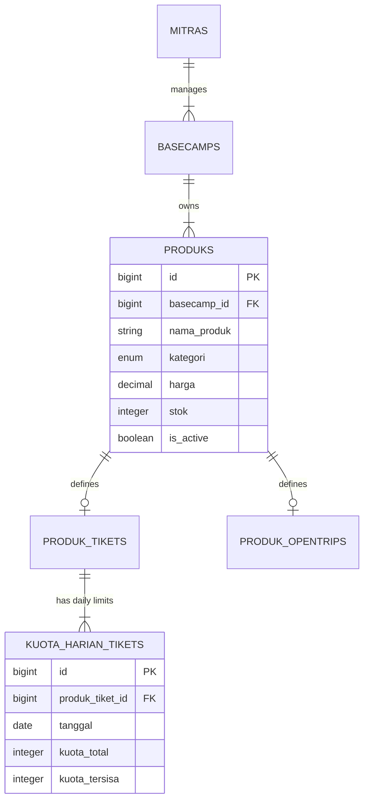

# MODULAR PRD 04: KATALOG PRODUK & INVENTARIS MITRA

Document Version: 1.0.0  
Status: Approved / Implementation Ready  
Target Module: Katalog Produk Basecamp, Kuota Harian Tiket, Stok Alat Rental, & Operasional Mitra  
Target Path: `docs/prd/modules/04-katalog-inventaris-mitra.md`

---

## GLOBAL API STANDARDIZATION & RESPONSE RULES

Aturan standar ini berlaku secara global di seluruh endpoint modul API Summit v2.

### 1. Standard URL Structure
* **API Prefix:** Seluruh API diawali dengan prefix `/api/v1/`.
* **Resource Naming:** Naming convention menggunakan `kebab-case` dan kata benda jamak (*plural nouns*) (misal: `/api/v1/mitra/products`, `/api/v1/mitra/quotas`, `/api/v1/mitra/emergency-closures`).
* **Parameter Handling:**
  * **Query Params:** Digunakan untuk filtering, sorting, dan paginasi (misal: `?kategori=rental&is_active=1&page=1&per_page=15`).
  * **Path Params:** Digunakan untuk mengidentifikasi resource tunggal berdasarkan ID (misal: `/api/v1/mitra/products/{id}`).

### 2. Standard HTTP Status Codes & Error Handling

| Status Code | Label | Skenario Penggunaan |
| :--- | :--- | :--- |
| `200 OK` | OK | Permintaan berhasil memproses data (Get, Put, Patch, Delete). |
| `201 Created` | Created | Produk / Kuota harian baru berhasil dibuat. |
| `400 Bad Request` | Bad Request | Parameter/payload secara logika bisnis tidak valid (kuota total < kuota terpakai). |
| `401 Unauthorized` | Unauthorized | Token Sanctum missing, invalid, atau expired. |
| `403 Forbidden` | Forbidden | Pengguna terautentikasi bukan `mitra` atau tidak memiliki hak atas basecamp terkait. |
| `404 Not Found` | Not Found | Resource produk/kuota/basecamp tidak ditemukan. |
| `422 Unprocessable Entity` | Validation Error | Form request validation Laravel gagal. |
| `500 Internal Server Error` | Server Error | Unhandled exception pada server. |

### 3. Standard Response Schema (JSON Envelope)

#### A. Single Data Success Envelope (`200 OK` / `201 Created`)
```json
{
  "status": "success",
  "message": "Produk berhasil diperbarui.",
  "data": {
    "id": 10,
    "basecamp_id": 1,
    "nama_produk": "Tenda Kapasitas 4 Orang",
    "kategori": "rental",
    "harga": 60000.00,
    "stok": 15,
    "is_active": true
  }
}
```

#### B. Paginated Array List Success Envelope (`200 OK`)
```json
{
  "status": "success",
  "message": "Daftar produk mitra berhasil diambil.",
  "data": [
    {
      "id": 10,
      "nama_produk": "Tenda Kapasitas 4 Orang",
      "kategori": "rental",
      "harga": 60000.00,
      "stok": 15,
      "is_active": true
    }
  ],
  "meta": {
    "current_page": 1,
    "from": 1,
    "last_page": 1,
    "per_page": 15,
    "to": 1,
    "total": 1
  },
  "links": {
    "first": "http://api.summit.test/api/v1/mitra/products?page=1",
    "last": "http://api.summit.test/api/v1/mitra/products?page=1",
    "prev": null,
    "next": null
  }
}
```

---

## 1. MODULE OVERVIEW

Modul **Katalog Produk & Inventaris Mitra** memberikan akses penuh kepada **Mitra Basecamp** untuk mengelola produk dan inventaris fisik maupun jasa yang dijual di marketplace platform **Summit v2**. Lingkup utama modul ini meliputi:

1. **CRUD Katalog Produk Mitra:** Pengelolaan item Tiket SIMAKSI, Sewa Alat (*Rental*), Jasa Porter/Guide, OpenTrip, Transportasi, Parkir, Merchandise, dan Logistik/Kuliner.
2. **Manajemen Kuota Harian Tiket (`kuota_harian_tikets`):** Pengaturan batas kuota pendaki harian (*daily booking limit*) secara spesifik per tanggal atau rentang tanggal (*batch date setup*).
3. **Manajemen Inventaris Stok Alat Rental:** Pembaruan jumlah stok alat fisik yang siap disewakan serta pelacakan ketersediaan otomatis saat dipesan pendaki.
4. **Penutupan Jalur Darurat (Emergency Trail Closure):** Fitur aksi cepat Mitra untuk menutup jalur pendakian secara mendadak akibat cuaca ekstrem/badai dan memblokir reservasi tiket baru secara *real-time*.

### Technical & UI Stack Implementation Details
* **Dashboard Mitra Web Application**: Built with **Vue.js 3** + **shadcn-vue** (Tailwind CSS based).
  - Target UI Components: `Data-Table` (inventaris produk & stok rental), `Dialog` (modal tambah/edit produk & batch kuota), `Form`, `Input`, `Select` (kategori produk), `Switch` / `Toggle` (is_active status), `Toast`, `Badge` (kategori & status stok).
* **Mobile Application (Pilihan Produk Pendaki)**: Built with **Quasar Framework (Vue 3)** + **Capacitor JS**.
  - Target UI Components: `q-page` (katalog sewa alat & porter), `q-list` & `q-item` (daftar item rental), `q-chip` (label ketersediaan stok), `q-badge`.


## 2. USER STORIES

| ID | Persona | User Story | Prioritas |
| :--- | :--- | :--- | :---: |
| **US-KAT-01** | Mitra | Sebagai Mitra, saya ingin melihat dan menambah produk baru (tiket, sewa alat, porter/guide, opentrip) di basecamp saya agar dapat dijual ke pendaki. | **P1** |
| **US-KAT-02** | Mitra | Sebagai Mitra, saya ingin memperbarui data produk (nama, deskripsi, harga, foto, status aktif) agar informasi produk selalu akurat. | **P1** |
| **US-KAT-03** | Mitra | Sebagai Mitra, saya ingin menguji dan menonaktifkan (*toggle active*) produk secara cepat jika barang rusak atau layanan dihentikan sementara. | **P1** |
| **US-KAT-04** | Mitra | Sebagai Mitra, saya ingin mengatur total kuota pendaki harian untuk rentang tanggal tertentu agar tiket tidak terpesan melebih batas kuota resmi. | **P1** |
| **US-KAT-05** | Mitra | Sebagai Mitra, saya ingin melihat kalendar sisa kuota harian untuk memantau hari mana saja yang sudah *full booked*. | **P1** |
| **US-KAT-06** | Mitra | Sebagai Mitra, saya ingin memperbarui stok fisik alat sewa (tenda, matras, sleeping bag) saat ada penambahan inventaris baru. | **P1** |
| **US-KAT-07** | Mitra | Sebagai Mitra, saya ingin menutup jalur pendakian secara darurat ketika terjadi badai/cuaca ekstrem agar tidak ada pendaki baru yang dapat memesan tiket. | **P1** |

---

## 3. FUNCTIONAL REQUIREMENTS (FR) & API CONTRACT MAPPING

| FR ID | Nama Fitur | HTTP Method & URL Endpoint | Request Payload / Headers | Expected Response Schema | Middleware / Guard |
| :--- | :--- | :--- | :--- | :--- | :--- |
| **FR-KAT-01** | List Produk Mitra | `GET /api/v1/mitra/products` | **Headers:** `Authorization: Bearer <token>`<br>**Query:** `basecamp_id` (int), `kategori` (enum), `is_active` (boolean), `page` (int) | `200 OK`<br>Paginated List Envelope (`ProdukResource`) | `auth:sanctum`, `role:mitra` |
| **FR-KAT-02** | Create Produk Baru | `POST /api/v1/mitra/products` | **Headers:** `Authorization: Bearer <token>`<br>**Body (multipart/form-data):**<br>`basecamp_id` (int, req)<br>`nama_produk` (string, req)<br>`kategori` (enum: ticket, rental, opentrip, guide, porter, transport, parkir, merchandise, kuliner, req)<br>`deskripsi` (string)<br>`harga` (decimal, req)<br>`stok` (int, req jika rental/merchandise)<br>`satuan` (string)<br>`gambar` (file: image, max 2MB)<br>*Spesifik Tiket:* `jalur_id` (int), `jam_buka` (time), `jam_tutup` (time)<br>*Spesifik OpenTrip:* `tanggal_berangkat` (date), `tanggal_pulang` (date), `meeting_point` (string), `minimal_peserta` (int), `maksimal_peserta` (int) | `201 Created`<br>Single Data Envelope (`ProdukResource`) | `auth:sanctum`, `role:mitra` |
| **FR-KAT-03** | Detail Produk | `GET /api/v1/mitra/products/{id}` | **Headers:** `Authorization: Bearer <token>`<br>**Path:** `id` (int) | `200 OK`<br>Single Data Envelope (`ProdukResource`) | `auth:sanctum`, `role:mitra` |
| **FR-KAT-04** | Update Produk | `POST /api/v1/mitra/products/{id}` *(dengan `_method=PUT`)* atau `PUT` | **Headers:** `Authorization: Bearer <token>`<br>**Path:** `id` (int)<br>**Body (multipart/form-data):** Payload serupa Create Produk | `200 OK`<br>Single Data Envelope (`ProdukResource`) | `auth:sanctum`, `role:mitra` |
| **FR-KAT-05** | Quick Toggle Status Produk | `PATCH /api/v1/mitra/products/{id}/toggle-status` | **Headers:** `Authorization: Bearer <token>`<br>**Path:** `id` (int)<br>**Body (JSON):** `is_active` (boolean, req) | `200 OK`<br>Single Data Envelope (`ProdukResource`) | `auth:sanctum`, `role:mitra` |
| **FR-KAT-06** | Delete Produk | `DELETE /api/v1/mitra/products/{id}` | **Headers:** `Authorization: Bearer <token>`<br>**Path:** `id` (int) | `200 OK`<br>Single Data Envelope (data: null) | `auth:sanctum`, `role:mitra` |
| **FR-KAT-07** | List Kuota Harian Tiket | `GET /api/v1/mitra/products/{id}/quotas` | **Headers:** `Authorization: Bearer <token>`<br>**Path:** `id` (int)<br>**Query:** `start_date` (date, req), `end_date` (date, req) | `200 OK`<br>List Array Envelope (`KuotaHarianResource`) | `auth:sanctum`, `role:mitra` |
| **FR-KAT-08** | Set Batch Kuota Harian | `POST /api/v1/mitra/products/{id}/quotas/batch` | **Headers:** `Authorization: Bearer <token>`<br>**Path:** `id` (int)<br>**Body (JSON):**<br>`start_date` (date, req)<br>`end_date` (date, req)<br>`kuota_total` (int, req, min:1) | `200 OK`<br>Message Envelope ("Kuota harian berhasil diset untuk rentang tanggal tersebut.") | `auth:sanctum`, `role:mitra` |
| **FR-KAT-09** | Update Kuota Tanggal Spesifik | `PUT /api/v1/mitra/quotas/{quota_id}` | **Headers:** `Authorization: Bearer <token>`<br>**Path:** `quota_id` (int)<br>**Body (JSON):** `kuota_total` (int, req) | `200 OK`<br>Single Data Envelope (`KuotaHarianResource`) | `auth:sanctum`, `role:mitra` |
| **FR-KAT-10** | Update Stok Rental | `PATCH /api/v1/mitra/products/{id}/stock` | **Headers:** `Authorization: Bearer <token>`<br>**Path:** `id` (int)<br>**Body (JSON):** `stok` (int, req, min:0) | `200 OK`<br>Single Data Envelope (`ProdukResource`) | `auth:sanctum`, `role:mitra` |
| **FR-KAT-11** | Closing Jalur Emergency | `POST /api/v1/mitra/trails/{jalur_id}/emergency-close` | **Headers:** `Authorization: Bearer <token>`<br>**Path:** `jalur_id` (int)<br>**Body (JSON):**<br>`status` (enum: open, close, req)<br>`alasan_penutupan` (string, req jika status=close) | `200 OK`<br>Message Envelope ("Status jalur berhasil diperbarui.") | `auth:sanctum`, `role:mitra` |

---

## 4. RELASI DATABASE & LOGIKA OPERASIONAL MITRA



### Logika Aturan Bisnis Kuota & Stok:
1. **Penetapan Kuota Harian Tiket (`kuota_harian_tikets`):**
   * Saat Mitra menyetir `kuota_total` baru pada tanggal yang belum ada record-nya, sistem mengeset `kuota_tersisa = kuota_total`.
   * Jika `kuota_total` diperbarui pada tanggal yang sudah memiliki reservasi terpakai (`kuota_terpakai = kuota_total_lama - kuota_tersisa`), nilai `kuota_total` baru **TIDAK BOLEH** lebih kecil dari `kuota_terpakai`.
2. **Hak Akses Mitra Multi-Basecamp:**
   * Setiap request dikontrol melalui middleware Otorisasi Policy (`BasecampPolicy`). Mitra **HANYA** diizinkan menambah/mengubah produk pada `basecamp_id` yang terdaftar sebagai miliknya di tabel `basecamps`.

---

## 5. NON-FUNCTIONAL REQUIREMENTS (NFR)

1. **Otorisasi & Keamanan Multi-Tenant:**
   * Validasi kepemilikan basecamp (`$user->mitra->basecamps->contains($basecamp_id)`) wajib diperiksa di Form Request / Policy untuk mencegah ID Tampering.
2. **Invalidasi Cache Otomatis:**
   * Setiap kali Mitra memperbarui data produk atau status jalur, cache Redis public master data (`mountains` & `trails`) wajib dibersihkan (*invalidated*).
3. **Integritas Data Transaksional:**
   * Penyetelan `kuota_harian_tikets` secara *batch date range* wajib menggunakan Database Transaction (`DB::transaction`) untuk memastikan *atomic execution*.

---

## 6. EDGE CASES & ERROR HANDLING

1. **Mitra Mengubah Kuota Lebih Kecil dari Tiket Terjual:**
   * Jika kuota total diturunkan menjadi 10 padahal tiket sudah terbayar 15 untuk tanggal tersebut, API menolak dengan `400 Bad Request` dan error code `ERR_INVALID_QUOTA_REDUCTION`.
2. **Penutupan Jalur Darurat Saat Ada Pesanan Pending:**
   * Saat `POST /api/v1/mitra/trails/{jalur_id}/emergency-close` dieksekusi dengan status `close`, pesanan tiket baru untuk jalur tersebut yang masih berstatus `pending` otomatis dibatalkan (*cancelled*) dan stok dikembalikan.
3. **Mengubah Stok Rental Menjadi Kurang Dari Jumlah Sewa Aktif:**
   * Mencegah pengurangan stok barang rental di bawah jumlah item yang sedang disewa oleh pendaki pada tanggal pendakian aktif.

---

## 7. SCOPE BOUNDARY

### In-Scope (v1.0 - Core Release)
* CRUD Produk Basecamp (Tiket, Rental, Porter, Guide, OpenTrip, Merchandise).
* Set & Edit Kuota Harian Tiket per Tanggal & Batch Date Range.
* Toggle Aktif/Nonaktif Produk & Update Stok Rental.
* Emergency Trail Closure oleh Mitra.

### Out-of-Scope (Fase Berikutnya)
* Dynamic Pricing / Surge Pricing otomatis berdasarkan high season/weekend.
* Auto-sync stok alat sewa dengan sistem barcode scanner fisik di gudang basecamp.
