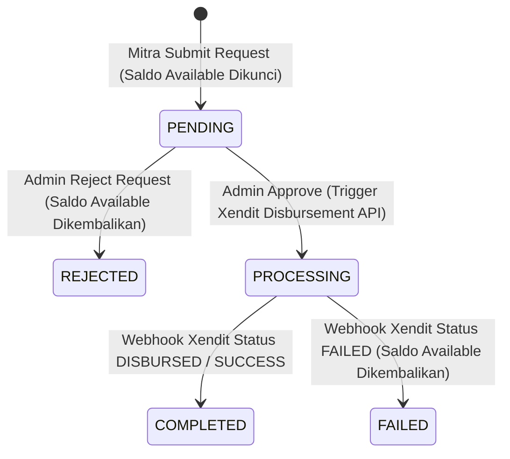

# MODULAR PRD 05: ESCROW LEDGER, MITRA WALLET, WITHDRAWAL, & REFUND MANAGEMENT

Document Version: 1.0.0  
Status: Approved / Implementation Ready  
Target Module: Akuntansi Ledger Escrow, Dompet Mitra (Wallet), Penarikan Dana (Withdrawal/Payout Xendit), & Pengajuan/Eksekusi Refund  
Target Path: `docs/prd/modules/05-escrow-withdrawal-refund.md`

---

## GLOBAL API STANDARDIZATION & RESPONSE RULES

Aturan standar ini berlaku secara global di seluruh endpoint modul API Summit v2.

### 1. Standard URL Structure
* **API Prefix:** Seluruh API diawali dengan prefix `/api/v1/`.
* **Resource Naming:** Naming convention menggunakan `kebab-case` dan kata benda jamak (*plural nouns*) (misal: `/api/v1/mitra/wallet`, `/api/v1/mitra/withdrawals`, `/api/v1/admin/refunds`, `/api/v1/payments/webhook/xendit-disbursement`).
* **Parameter Handling:**
  * **Query Params:** Digunakan untuk filtering, sorting, dan paginasi (misal: `?status=pending&page=1&per_page=15`).
  * **Path Params:** Digunakan untuk mengidentifikasi ID pesanan atau ID penarikan dana (misal: `/api/v1/mitra/withdrawals/{id}`).

### 2. Standard HTTP Status Codes & Error Handling

| Status Code | Label | Skenario Penggunaan |
| :--- | :--- | :--- |
| `200 OK` | OK | Permintaan berhasil memproses data / approve withdrawal / refund. |
| `201 Created` | Created | Pengajuan withdrawal / pengajuan refund baru berhasil dibuat. |
| `400 Bad Request` | Bad Request | Saldo available tidak mencukupi untuk withdrawal, atau pesanan tidak eligible refund. |
| `401 Unauthorized` | Unauthorized | Token Sanctum missing, invalid, atau expired. |
| `403 Forbidden` | Forbidden | Pengguna bukan role yang berhak (bukan mitra/admin terkait). |
| `404 Not Found` | Not Found | Transaction / Withdrawal / Refund record tidak ditemukan. |
| `422 Unprocessable Entity` | Validation Error | Form request validation Laravel gagal (nominal withdrawal invalid / bank account missing). |
| `500 Internal Server Error` | Server Error | Unhandled exception atau kegagalan API Gateway Xendit Disbursement. |

---

## 1. MODULE OVERVIEW

Modul **Escrow Ledger, Mitra Wallet, Withdrawal, & Refund Management** mengelola arus keuangan paska-pembayaran (*post-payment financial flow*) pada platform **Summit v2**. Lingkup utama modul ini meliputi:

1. **Escrow Ledger & Internal Wallet Mitra:** Pencatatan pemisahan saldo virtual Mitra antara *Saldo Pending (Escrow Holding)* dan *Saldo Available (Ready to Withdraw)*. Saldo menjadi *Available* secara otomatis setelah pendakian selesai divalidasi (`pesanans.status = completed`).
2. **Mitra Payout / Withdrawal Request:** Fitur Mitra mengajukan penarikan saldo *Available* ke rekening bank terverifikasi (`mitras.rekening_bank`).
3. **Integrasi Automatic Disbursement (Xendit Iris/Disbursement API):** Eksekusi pencairan dana otomatis dari platform ke rekening Mitra via API Xendit serta penanganan webhook callback status transfer.
4. **Pengajuan & Eksekusi Refund:** Logika pengembalian dana kepada Pendaki saat terjadi pembatalan pesanan akibat penutupan jalur darurat (*force majeure*) atau persetujuan klaim Admin.

### Technical & UI Stack Implementation Details
* **Web Dashboard Mitra & Admin Platform**: Built with **Vue.js 3** + **shadcn-vue** (Tailwind CSS based).
  - Target UI Components: `Card` (ringkasan Saldo Pending vs Available), `Data-Table` (mutasi ledger & riwayat withdrawal/refund), `Dialog` (modal pengajuan penarikan & konfirmasi approve/reject payout), `Badge` (status pending/disbursed/failed/refunded), `Toast`.
* **Mobile Pendaki App**: Built with **Quasar Framework (Vue 3)** + **Capacitor JS**.
  - Target UI Components: `q-page` (halaman status pengajuan refund), `q-card` (ringkasan pengembalian dana), `q-badge` (status refund).

## 2. USER STORIES

| ID | Persona | User Story | Prioritas |
| :--- | :--- | :--- | :---: |
| **US-ESC-01** | Mitra | Sebagai Mitra, saya ingin melihat rincian saldo dompet saya (Saldo Pending Escrow, Saldo Available, dan Total Terhitung) agar saya tahu kapan dana bisa ditarik. | **P1** |
| **US-ESC-02** | Mitra | Sebagai Mitra, saya ingin melihat riwayat mutasi ledger keuangan dari pesanan yang sudah *completed* agar pencatatan keuangan transparan. | **P1** |
| **US-ESC-03** | Mitra | Sebagai Mitra, saya ingin mengajukan penarikan dana (*withdrawal*) dari Saldo Available ke rekening bank resmi saya. | **P1** |
| **US-ESC-04** | Admin | Sebagai Admin, saya ingin meninjau dan menyetujui (*approve*) atau menolak (*reject*) pengajuan penarikan dana mitra. | **P1** |
| **US-ESC-05** | Admin | Sebagai Admin, saya ingin sistem mengeksekusi pencairan dana otomatis ke rekening bank mitra menggunakan API Xendit Disbursement saat permohonan disetujui. | **P1** |
| **US-ESC-06** | Pendaki / Admin | Sebagai Pendaki/Admin, saya ingin mengajukan dan memproses refund dana transaksi jika jalur ditutup mendadak oleh basecamp karena cuaca ekstrem. | **P1** |

---

## 3. FUNCTIONAL REQUIREMENTS (FR) & API CONTRACT MAPPING

| FR ID | Nama Fitur | HTTP Method & URL Endpoint | Request Payload / Headers | Expected Response Schema | Middleware / Guard |
| :--- | :--- | :--- | :--- | :--- | :--- |
| **FR-ESC-01** | Get Mitra Wallet Summary | `GET /api/v1/mitra/wallet` | **Headers:** `Authorization: Bearer <token>` | `200 OK` Single Data Envelope (`MitraWalletResource`) | `auth:sanctum`, `role:mitra` |
| **FR-ESC-02** | Get Financial Ledger History | `GET /api/v1/mitra/wallet/ledger` | **Headers:** `Authorization: Bearer <token>` **Query:** `status_escrow` (holding, eligible, disbursed), `page` (int) | `200 OK` Paginated List Envelope (`MitraLedgerResource`) | `auth:sanctum`, `role:mitra` |
| **FR-ESC-03** | Request Withdrawal Mitra | `POST /api/v1/mitra/withdrawals` | **Headers:** `Authorization: Bearer <token>` **Body (JSON):** `nominal` (decimal, req, min:50000) `catatan` (string, optional) | `201 Created` Single Data Envelope (`WithdrawalResource`) | `auth:sanctum`, `role:mitra` |
| **FR-ESC-04** | List Withdrawal Mitra History | `GET /api/v1/mitra/withdrawals` | **Headers:** `Authorization: Bearer <token>` **Query:** `status` (pending, completed, failed), `page` (int) | `200 OK` Paginated List Envelope (`WithdrawalResource`) | `auth:sanctum`, `role:mitra` |
| **FR-ESC-05** | List All Withdrawals (Admin) | `GET /api/v1/admin/withdrawals` | **Headers:** `Authorization: Bearer <token>` **Query:** `status` (pending, approved, completed, rejected), `page` (int) | `200 OK` Paginated List Envelope (`WithdrawalResource`) | `auth:sanctum`, `role:admin` |
| **FR-ESC-06** | Approve & Trigger Xendit Payout | `POST /api/v1/admin/withdrawals/{id}/approve` | **Headers:** `Authorization: Bearer <token>` **Path:** `id` (int) | `200 OK` Single Data Envelope (`WithdrawalResource`) | `auth:sanctum`, `role:admin` |
| **FR-ESC-07** | Reject Withdrawal Request | `POST /api/v1/admin/withdrawals/{id}/reject` | **Headers:** `Authorization: Bearer <token>` **Path:** `id` (int) **Body (JSON):** `alasan_penolakan` (string, req) | `200 OK` Single Data Envelope (`WithdrawalResource`) | `auth:sanctum`, `role:admin` |
| **FR-ESC-08** | Xendit Disbursement Webhook | `POST /api/v1/payments/webhook/xendit-disbursement` | **Headers:** `x-callback-token: <verification_token>` | `200 OK` Message Envelope ("Disbursement webhook processed.") | Public (Xendit Verified Token) |
| **FR-ESC-09** | Pengajuan Refund Transaksi | `POST /api/v1/orders/{invoice}/refund-request` | **Headers:** `Authorization: Bearer <token>` **Path:** `invoice` (string) **Body (JSON):** `alasan` (string, req) `bank_tujuan` (string, req) `rekening_tujuan` (string, req) `nama_tujuan` (string, req) | `201 Created` Single Data Envelope (`RefundResource`) | `auth:sanctum` |
| **FR-ESC-10** | List & Process Refund (Admin) | `POST /api/v1/admin/refunds/{id}/process` | **Headers:** `Authorization: Bearer <token>` **Path:** `id` (int) **Body (JSON):** `status` (enum: approved, rejected) `tipe_eksekusi` (enum: auto, manual) `catatan` (string) | `200 OK` Single Data Envelope (`RefundResource`) | `auth:sanctum`, `role:admin` |

---

## 4. LOGIKA FINANSIAL & LEDGER STATE MACHINE

### 4.1. Formula Kategori Saldo Wallet Mitra
$$\begin{aligned}
\text{Saldo Pending (Escrow Holding)} &= \sum \text{pesanans.pendapatan\_mitra} \quad \text{dimana } \text{pesanans.status} = \text{'paid'} \text{ ATAU } \text{'on\_going'} \\
\text{Saldo Available (Ready to Withdraw)} &= \sum \text{pesanans.pendapatan\_mitra} \quad \text{dimana } \text{pesanans.status} = \text{'completed'} \\
&\quad - \sum \text{withdrawals.nominal} \quad \text{dimana } \text{withdrawals.status} \in \{\text{'pending'}, \text{'completed'}\}
\end{aligned}$$

### 4.2. State Diagram Transaksi Disbursement / Withdrawal

---

## 5. NON-FUNCTIONAL REQUIREMENTS (NFR)

1. **Proteksi Concurrency & Double Spending Balance:**
   * Saat `POST /api/v1/mitra/withdrawals` diproses, pengecekan Saldo Available dan pencatatan draft withdrawal **WAJIB** berada dalam `DB::transaction` dengan `lockForUpdate()` pada entitas saldo/mitra untuk mencegah pengajuan ganda secara simultan.
2. **Keamanan Webhook Token Verification:**
   * Endpoint `POST /api/v1/payments/webhook/xendit-disbursement` wajib menverifikasi header `x-callback-token` yang valid sesuai environment key Xendit sebelum mengubah status penarikan dana.
3. **Presisi Decimal Finansial:**
   * Seluruh nilai `nominal`, `saldo_pending`, `saldo_available`, dan `pendapatan_mitra` wajib diproses sebagai `DECIMAL(15,2)` tanpa floating-point rounding error.

---

## 6. EDGE CASES & ERROR HANDLING

1. **Mitra Mengajukan Penarikan Melebihi Saldo Available:**
   * Pengajuan ditolak langsung dengan status `400 Bad Request` dan error code `ERR_INSUFFICIENT_AVAILABLE_BALANCE`.
2. **Kegagalan Transfer Xendit Disbursement (Nama Rekening Mismatch / Bank Down):**
   * Jika Xendit mengembalikan webhook `FAILED`, status penarikan diubah menjadi `failed`, log pesan kegagalan disimpan di `failure_reason`, dan nominal yang terkunci otomatis dikembalikan ke Saldo Available Mitra.
3. **Pengajuan Refund Pada Pesanan Yang Sudah Disbursed:**
   * Jika pesanan sudah berstatus `completed` dan dananya sudah ditarik Mitra, pengajuan refund otomatis membutuhkan approval penanganan klaim Admin khusus (manual dispute resolution).

---

## 7. SCOPE BOUNDARY

### In-Scope (v1.0 - Core Release)
* Ringkasan Wallet Mitra (Saldo Pending Escrow, Saldo Available, Total Terhitung).
* Request Withdrawal oleh Mitra ke rekening bank terdaftar.
* Management Approval/Rejection Withdrawal & Trigger Xendit Disbursement oleh Admin.
* Webhook Callback Handling Xendit Disbursement Status Updates.
* Form Pengajuan & Persetujuan Refund Transaksi.

### Out-of-Scope (Fase Berikutnya)
* Fitur penarikan dana instan 24/7 tanpa perlu persetujuan manual Admin (*Instant Auto-Payout*).
* Split payout otomatis ke multiple rekening sub-mitra/guide secara langsung di gateway level.
