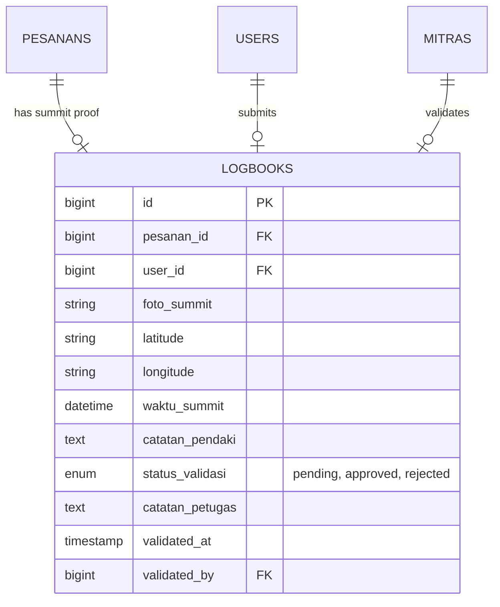

# MODULAR PRD 06: DIGITAL LOGBOOK & SUMMIT PROOF VALIDATION

Document Version: 1.0.0  
Status: Approved / Implementation Ready  
Target Module: Upload Bukti Summit, Validasi Turun Gunung (Check-Out Basecamp), & Generasi E-Certificate Pendakian  
Target Path: `docs/prd/modules/06-digital-logbook-summit.md`

---

## GLOBAL API STANDARDIZATION & RESPONSE RULES

Aturan standar ini berlaku secara global di seluruh endpoint modul API Summit v2.

### 1. Standard URL Structure
* **API Prefix:** Seluruh API diawali dengan prefix `/api/v1/`.
* **Resource Naming:** Naming convention menggunakan `kebab-case` dan kata benda jamak (*plural nouns*) (misal: `/api/v1/orders/{invoice}/logbook`, `/api/v1/basecamp/logbooks`).
* **Parameter Handling:**
  * **Query Params:** Digunakan untuk filtering dan paginasi (misal: `?status_validasi=pending&page=1&per_page=15`).
  * **Path Params:** Digunakan untuk mengidentifikasi nomor invoice pesanan atau ID logbook (misal: `/api/v1/orders/{invoice}/logbook`).

### 2. Standard HTTP Status Codes & Error Handling

| Status Code | Label | Skenario Penggunaan |
| :--- | :--- | :--- |
| `200 OK` | OK | Permintaan berhasil memproses data / validasi logbook. |
| `201 Created` | Created | Unggahan foto bukti summit / logbook baru berhasil dibuat. |
| `400 Bad Request` | Bad Request | Pesanan belum berstatus `ON_GOING` atau bukti summit sudah diunggah. |
| `401 Unauthorized` | Unauthorized | Token Sanctum missing, invalid, atau expired. |
| `403 Forbidden` | Forbidden | Pendaki bukan pemilik pesanan atau Mitra bukan pengelola basecamp pesanan tersebut. |
| `404 Not Found` | Not Found | Invoice pesanan atau logbook tidak ditemukan. |
| `422 Unprocessable Entity` | Validation Error | Form request validation Laravel gagal (file foto missing / format non-image / ukuran > 5MB). |
| `500 Internal Server Error` | Server Error | Unhandled exception saat menyimpan media atau membuat PDF E-Certificate. |

---

## 1. MODULE OVERVIEW

Modul **Digital Logbook & Summit Proof Validation** mengelola proses pelaporan fisik puncak (*summit verification*) dan pencatatan riwayat pendakian pada platform **Summit v2**. Lingkup utama modul ini meliputi:

1. **Upload Summit Proof oleh Pendaki:** Pendaki mengunggah foto bukti di puncak gunung (lengkap dengan timestamp & geotag koordinat GPS jika ada) saat status pendakian `ON_GOING`.
2. **Validasi Petugas Basecamp (Check-Out Verification):** Petugas Mitra/Basecamp meninjau foto bukti puncak saat Pendaki melaporkan diri di pos bawah untuk proses Check-Out.
3. **Penerbitan Sertifikat Digital (E-Certificate / Digital Badge):** Setelah logbook disetujui Mitra dan status pesanan berubah menjadi `COMPLETED`, sistem secara otomatis menerbitkan Sertifikat Pendakian Digital berbentuk PDF & Badge Profil personal Pendaki.

### Technical & UI Stack Implementation Details
* **Web Dashboard Mitra Basecamp**: Built with **Vue.js 3** + **shadcn-vue** (Tailwind CSS based).
  - Target UI Components: `Data-Table` (permohonan validasi logbook pendaki), `Dialog` (modal preview foto summit & form approval/rejection), `Badge` (status approved/rejected/pending), `Toast`.
* **Mobile Pendaki App**: Built with **Quasar Framework (Vue 3)** + **Capacitor JS**.
  - Target UI Components: `q-page` (halaman logbook digital & galeri badge), `q-uploader` / `@capacitor/camera` (pengambil foto summit proof dengan kompresi client-side), `q-btn` (tombol upload & download e-certificate), `q-card` (preview bukti puncak & sertifikat PDF).
  - Native Hardware Integration: Menggunakan plugin `@capacitor/camera` dan `@capacitor/geolocation` untuk verifikasi koordinat lokasi puncak.

## 2. USER STORIES

| ID | Persona | User Story | Prioritas |
| :--- | :--- | :--- | :---: |
| **US-LOG-01** | Pendaki | Sebagai Pendaki, saya ingin mengunggah foto bukti puncak (*summit proof*) beserta catatan pengalaman saya selama di gunung agar riwayat pendakian saya tercatat. | **P2** |
| **US-LOG-02** | Pendaki | Sebagai Pendaki, saya ingin melihat status validasi logbook saya (pending / disetujui / ditolak) oleh petugas basecamp. | **P2** |
| **US-LOG-03** | Pendaki | Sebagai Pendaki, saya ingin mengunduh Sertifikat Pendakian Digital (PDF) dan melihat Digital Badge di profil saya setelah pendakian terkonfirmasi *completed*. | **P2** |
| **US-LOG-04** | Mitra | Sebagai Mitra, saya ingin melihat daftar permohonan validasi summit logbook dari pendaki yang sedang turun di basecamp saya. | **P2** |
| **US-LOG-05** | Mitra | Sebagai Mitra, saya ingin menyetujui (*approve*) atau menolak (*reject*) bukti summit pendaki saat proses Check-Out fisik di basecamp. | **P2** |

---

## 3. FUNCTIONAL REQUIREMENTS (FR) & API CONTRACT MAPPING

| FR ID | Nama Fitur | HTTP Method & URL Endpoint | Request Payload / Headers | Expected Response Schema | Middleware / Guard |
| :--- | :--- | :--- | :--- | :--- | :--- |
| **FR-LOG-01** | Upload Summit Proof | `POST /api/v1/orders/{invoice}/logbook` | **Headers:** `Authorization: Bearer <token>` **Path:** `invoice` (string) **Body (multipart/form-data):** `foto_summit` (file: image, max 5MB, req) `catatan_pendaki` (string, optional) `latitude` (string, optional) `longitude` (string, optional) `waktu_summit` (datetime, optional) | `201 Created` Single Data Envelope (`LogbookResource`) | `auth:sanctum`, `role:pendaki` |
| **FR-LOG-02** | Show Logbook Detail | `GET /api/v1/orders/{invoice}/logbook` | **Headers:** `Authorization: Bearer <token>` **Path:** `invoice` (string) | `200 OK` Single Data Envelope (`LogbookResource`) | `auth:sanctum` |
| **FR-LOG-03** | List Basecamp Logbooks | `GET /api/v1/basecamp/logbooks` | **Headers:** `Authorization: Bearer <token>` **Query:** `status_validasi` (pending, approved, rejected), `page` (int) | `200 OK` Paginated List Envelope (`LogbookResource`) | `auth:sanctum`, `role:mitra` |
| **FR-LOG-04** | Verify Summit Logbook | `POST /api/v1/basecamp/logbooks/{id}/verify` | **Headers:** `Authorization: Bearer <token>` **Path:** `id` (int) **Body (JSON):** `status_validasi` (enum: approved, rejected, req) `catatan_petugas` (string, req jika status_validasi=rejected) | `200 OK` Single Data Envelope (`LogbookResource`) | `auth:sanctum`, `role:mitra` |
| **FR-LOG-05** | Download E-Certificate | `GET /api/v1/orders/{invoice}/certificate` | **Headers:** `Authorization: Bearer <token>` **Path:** `invoice` (string) | `200 OK` Binary Stream (`application/pdf`) | `auth:sanctum` |
| **FR-LOG-06** | My Climbing Badges | `GET /api/v1/pendaki/badges` | **Headers:** `Authorization: Bearer <token>` | `200 OK` List Array Envelope (`BadgeResource`) | `auth:sanctum`, `role:pendaki` |

---

## 4. RELASI DATABASE & LOGIKA VALIDASI

### Logika Integrasi Check-Out & Escrow:
1. **Prasyarat Check-Out:** Pengunggahan *Summit Proof* bersifat opsional untuk pendaki yang tidak mencapai puncak (misal: *evakuasi/turun awal*). Namun, jika diunggah, Mitra wajib memvalidasi foto tersebut saat proses Check-Out.
2. **Auto-Generate E-Certificate:** Ketika status logbook diubah menjadi `approved` dan pesanan menjadi `COMPLETED`, background job (`GenerateCertificatePdf`) dipanggil untuk membuat dokumen PDF sertifikat secara otomatis.

---

## 5. NON-FUNCTIONAL REQUIREMENTS (NFR)

1. **Storage Optimization & Private Stream:**
   * Foto *summit proof* disimpan di disk `public` storage yang di-optimize (WebP max 2MB).
   * Berkas PDF E-Certificate disimpan di storage lokal privat dan di-stream melalui endpoint API resmi.
2. **Generasi PDF Asynchronous:**
   * Pembuatan PDF sertifikat menggunakan Laravel Queue (`ShouldQueue`) untuk mencegah latency API Check-Out melampaui 500ms.

---

## 6. EDGE CASES & ERROR HANDLING

1. **Unggah Foto Summit Sebelum Tanggal Booking / Belum Check-In:**
   * Ditolak dengan `400 Bad Request` (`ERR_ORDER_NOT_ACTIVE`) jika status pesanan bukan `ON_GOING`.
2. **Foto Berkas Rusak / Format Tidak Sesuai:**
   * Ditolak oleh validator `422 Unprocessable Entity` dengan error message `"The foto summit field must be an image (jpg, jpeg, png, webp)."`.

---

## 7. SCOPE BOUNDARY

### In-Scope (v1.0 - Core Release)
* Upload Foto Summit Proof & Catatan Pendaki.
* Verifikasi Approve/Reject Logbook oleh Mitra Basecamp.
* Downloadeable E-Certificate PDF resmi per pendakian selesai.
* Galeri Badge Prestasi Pendakian di profil Pendaki.

### Out-of-Scope (Fase Berikutnya)
* Auto AI Fraud Detection (Face recognition / Exif GPS verification) pada foto puncak.
* Integrasi pencetakan fisik fisik E-Certificate dengan pengiriman kurir.
