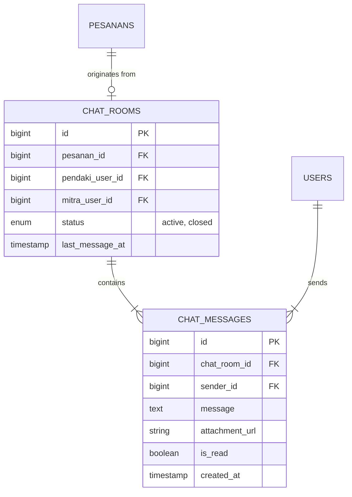

# MODULAR PRD 07: IN-APP CHAT & REAL-TIME COMMUNICATION

Document Version: 1.0.0  
Status: Approved / Implementation Ready  
Target Module: Komunikasi Real-time (Chat Teks & Lampiran) Antara Pendaki dan Mitra Basecamp / Guide  
Target Path: `docs/prd/modules/07-in-app-chat.md`

---

## GLOBAL API STANDARDIZATION & RESPONSE RULES

Aturan standar ini berlaku secara global di seluruh endpoint modul API Summit v2.

### 1. Standard URL Structure
* **API Prefix:** Seluruh API diawali dengan prefix `/api/v1/`.
* **Resource Naming:** Naming convention menggunakan `kebab-case` dan kata benda jamak (*plural nouns*) (misal: `/api/v1/chat/rooms`, `/api/v1/chat/rooms/{room_id}/messages`).
* **Parameter Handling:**
  * **Query Params:** Digunakan untuk paginasi riwayat obrolan (misal: `?page=1&per_page=30`).
  * **Path Params:** Digunakan untuk mengidentifikasi ID ruang obrolan (`room_id`).

### 2. Standard HTTP Status Codes & Error Handling

| Status Code | Label | Skenario Penggunaan |
| :--- | :--- | :--- |
| `200 OK` | OK | Memuat riwayat pesan / tandai pesan terbaca (*read receipt*). |
| `201 Created` | Created | Pesan obrolan atau ruang chat baru berhasil dibuat. |
| `400 Bad Request` | Bad Request | Sesi transaksi tidak valid atau room chat sudah ditutup (*archived*). |
| `401 Unauthorized` | Unauthorized | Token Sanctum missing, invalid, atau expired. |
| `403 Forbidden` | Forbidden | Pengguna bukan merupakan partisipan (Pendaki/Mitra/Guide) dari ruang obrolan terkait. |
| `404 Not Found` | Not Found | Room ID atau pesan tidak ditemukan. |
| `422 Unprocessable Entity` | Validation Error | Pesan kosong dan tanpa lampiran gambar. |
| `500 Internal Server Error` | Server Error | Kegagalan broadcast event WebSocket / Server Error. |

---

## 1. MODULE OVERVIEW

Modul **In-App Chat & Real-Time Communication** menyediakan sarana komunikasi dua arah berbasis teks dan gambar antara **Pendaki** dan **Mitra Basecamp / Guide** pada platform **Summit v2**. Modul ini dirancang untuk koordinasi pra-pendakian (persiapan logistik, cuaca, meeting point) dan selama pendakian. Lingkup utama modul ini meliputi:

1. **Pembuatan Room Chat Terikat Pesanan:** Ruang obrolan otomatis tergenerasi saat transaksi pesanan berstatus `PAID` atau `ON_GOING`, menghubungkan Pendaki dengan Mitra Basecamp/Guide terkait `pesanan_id`.
2. **Pengiriman Pesan Teks & Lampiran Gambar:** Pertukaran pesan teks serta gambar (misal: foto peralatan/peta) secara real-time.
3. **Broadcasting Event Real-Time (Laravel Reverb / WebSockets / Pusher):** Sinkronisasi pesan instan tanpa perlu polling HTTP.
4. **Indikator Unread & Status Terbaca (Read Receipt):** Menampilkan jumlah pesan yang belum dibaca dan status pesan telah dibaca oleh penerima.

### Technical & UI Stack Implementation Details
* **Web Dashboard Mitra Basecamp**: Built with **Vue.js 3** + **shadcn-vue** (Tailwind CSS based).
  - Target UI Components: `Card` (kontainer interface chat), `Input` & `Button` (form pengirim pesan), `Scroll-Area`, `Badge` (unread counter), `Dialog` (preview lampiran foto).
* **Mobile Pendaki App**: Built with **Quasar Framework (Vue 3)** + **Capacitor JS**.
  - Target UI Components: `q-page` (halaman ruang chat & daftar percakapan), `q-list` & `q-item` (daftar room chat), `q-chat-message` (bubble pesan teks/gambar & read status), `q-input` (input bar obrolan), `q-btn` (tombol attachment foto via `@capacitor/camera`).

---

## 2. USER STORIES

| ID | Persona | User Story | Prioritas |
| :--- | :--- | :--- | :---: |
| **US-CHT-01** | Pendaki | Sebagai Pendaki, saya ingin membuka ruang obrolan dengan Mitra/Guide setelah pembayaran tiket berhasil agar dapat berkoordinasi sebelum pendakian. | **P2** |
| **US-CHT-02** | Pendaki / Mitra | Sebagai Pengguna, saya ingin mengirim pesan teks dan foto perlengkapan pada ruang obrolan agar komunikasi lebih jelas. | **P2** |
| **US-CHT-03** | Pendaki / Mitra | Sebagai Pengguna, saya ingin menerima notifikasi dan pesan baru secara *real-time* saat aplikasi sedang terbuka. | **P2** |
| **US-CHT-04** | Mitra | Sebagai Mitra, saya ingin melihat daftar seluruh ruang obrolan aktif dari para pendaki yang memesan di basecamp saya. | **P2** |

---

## 3. FUNCTIONAL REQUIREMENTS (FR) & API CONTRACT MAPPING

| FR ID | Nama Fitur | HTTP Method & URL Endpoint | Request Payload / Headers | Expected Response Schema | Middleware / Guard |
| :--- | :--- | :--- | :--- | :--- | :--- |
| **FR-CHT-01** | Get / Create Chat Room | `POST /api/v1/chat/rooms` | **Headers:** `Authorization: Bearer <token>` **Body (JSON):** `pesanan_id` (int, req) | `200 OK` / `201 Created` Single Data Envelope (`ChatRoomResource`) | `auth:sanctum` |
| **FR-CHT-02** | List Active Chat Rooms | `GET /api/v1/chat/rooms` | **Headers:** `Authorization: Bearer <token>` **Query:** `page` (int) | `200 OK` Paginated List Envelope (`ChatRoomResource`) | `auth:sanctum` |
| **FR-CHT-03** | Get Chat Messages History | `GET /api/v1/chat/rooms/{room_id}/messages` | **Headers:** `Authorization: Bearer <token>` **Path:** `room_id` (int) **Query:** `page` (int, default: 1) | `200 OK` Paginated List Envelope (`ChatMessageResource`) | `auth:sanctum` |
| **FR-CHT-04** | Send Chat Message | `POST /api/v1/chat/rooms/{room_id}/messages` | **Headers:** `Authorization: Bearer <token>` **Path:** `room_id` (int) **Body (multipart/form-data):** `message` (string, optional) `attachment` (file: image, max 2MB, optional) | `201 Created` Single Data Envelope (`ChatMessageResource`) | `auth:sanctum` |
| **FR-CHT-05** | Mark Messages as Read | `POST /api/v1/chat/rooms/{room_id}/read` | **Headers:** `Authorization: Bearer <token>` **Path:** `room_id` (int) | `200 OK` Message Envelope ("Pesan ditandai sebagai dibaca.") | `auth:sanctum` |

---

## 4. ARSITEKTUR BROADCASTING & RELASI DATABASE

### Event Broadcasting Flow (Laravel Reverb / WebSockets):
1. Saat endpoint `POST /api/v1/chat/rooms/{room_id}/messages` berhasil mengeksekusi insert message, server memicu Event Class: `event(new MessageSentEvent($message))`.
2. Channel Privat WebSocket: `private-chat.room.{room_id}`.
3. Payload event disiarkan langsung ke client Mobile (Quasar Framework) & Web (Vue.js 3) yang mendengarkan channel tersebut.

---

## 5. NON-FUNCTIONAL REQUIREMENTS (NFR)

1. **Latensi Pesan Instan:**
   * Waktu penyampaian pesan dari pengirim ke penerima via WebSocket channel < **200 ms**.
2. **Otorisasi Channel Privat WebSocket:**
   * WebSocket authentication endpoint (`POST /broadcasting/auth`) wajib memvalidasi token Sanctum dan memastikan user ID terdaftar sebagai `pendaki_user_id` atau `mitra_user_id` pada `chat_room_id` tersebut.
3. **Penyimpanan Gambar Ringan:**
   * Berkas lampiran gambar di-compress otomatis sebelum disimpan ke disk public.

---

## 6. EDGE CASES & ERROR HANDLING

1. **Mengirim Pesan Pada Pesanan Yang Sudah Selesai / Expired:**
   * Jika status pesanan `expired`, `cancelled`, atau `completed` > 7 hari, status room chat otomatis berubah menjadi `closed`. Pengiriman pesan baru ditolak dengan `400 Bad Request` (`ERR_CHAT_ROOM_CLOSED`).
2. **Mencoba Mengakses Chat Room Pengguna Lain:**
   * Ditolak langsung oleh middleware Authorization Policy dengan `403 Forbidden`.

---

## 7. SCOPE BOUNDARY

### In-Scope (v1.0 - Core Release)
* Text & Image Attachment Messaging.
* WebSocket Event Broadcasting per Chat Room.
* History Message Pagination & Unread Counter.
* Status Terbaca (*Read Receipt*).

### Out-of-Scope (Fase Berikutnya)
* Voice Call & Video Call.
* Group Chat publik multi-rombongan (Open Trip Community Chat).
* Auto-translation pesan bahasa asing.
