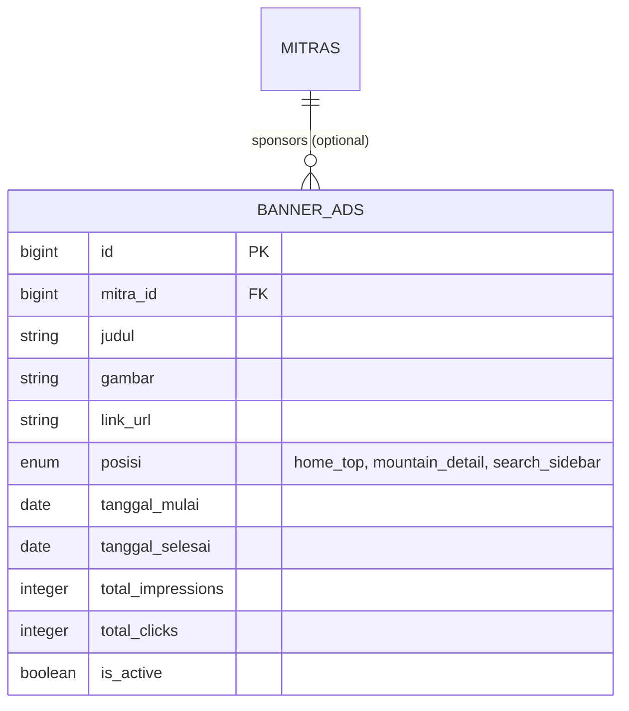

# MODULAR PRD 08: ADS & MONETIZATION MANAGEMENT

Document Version: 1.0.0  
Status: Approved / Implementation Ready  
Target Module: Slotting Banner Iklan, Promosi Mitra, & Tracking Impresi / Klik  
Target Path: `docs/prd/modules/08-ads-monetization.md`

---

## GLOBAL API STANDARDIZATION & RESPONSE RULES

Aturan standar ini berlaku secara global di seluruh endpoint modul API Summit v2.

### 1. Standard URL Structure
* **API Prefix:** Seluruh API diawali dengan prefix `/api/v1/`.
* **Resource Naming:** Naming convention menggunakan `kebab-case` dan kata benda jamak (*plural nouns*) (misal: `/api/v1/ads/banners`, `/api/v1/admin/ads/banners`).
* **Parameter Handling:**
  * **Query Params:** Digunakan untuk filtering posisi iklan dan paginasi (misal: `?posisi=home_top&is_active=1`).
  * **Path Params:** Digunakan untuk mengidentifikasi ID banner iklan (`id`).

### 2. Standard HTTP Status Codes & Error Handling

| Status Code | Label | Skenario Penggunaan |
| :--- | :--- | :--- |
| `200 OK` | OK | Permintaan berhasil memuat daftar iklan / update banner / catat impresi. |
| `201 Created` | Created | Slot banner iklan baru berhasil dibuat. |
| `400 Bad Request` | Bad Request | Tanggal berakhir iklan lebih awal dari tanggal mulai. |
| `401 Unauthorized` | Unauthorized | Token Sanctum missing, invalid, atau expired. |
| `403 Forbidden` | Forbidden | Pengguna bukan Admin (role mismatch). |
| `404 Not Found` | Not Found | ID Banner tidak ditemukan. |
| `422 Unprocessable Entity` | Validation Error | Form request validation Laravel gagal (file banner missing / dimensi non-standard). |
| `500 Internal Server Error` | Server Error | Unhandled exception pada server. |

---

## 1. MODULE OVERVIEW

Modul **Ads & Monetization Management** menyediakan fitur monetisasi bagi **Admin Platform** untuk mengelola ruang promosi dan slot banner iklan pada aplikasi mobile Pendaki maupun platform web **Summit v2**. Lingkup utama modul ini meliputi:

1. **CRUD Slot Banner Iklan oleh Admin:** Pengaturan judul banner, foto visual promosi, link tujuan (*deep link / external URL*), posisi slot (*home top, mountain detail, search sidebar*), dan periode tanggal tayang.
2. **Public Active Banner Delivery:** Endpoint publik yang menyajikan daftar banner promosi aktif yang sesuai dengan periode waktu dan slot posisi saat ini.
3. **Tracking Impresi & Klik (Analytics):** Pelacakan performa statistik berapa kali iklan ditampilkan (*impressions*) dan berapa kali iklan diklik (*clicks*) oleh pengguna untuk pelaporan monetisasi.

### Technical & UI Stack Implementation Details
* **Web Admin Platform**: Built with **Vue.js 3** + **shadcn-vue** (Tailwind CSS based).
  - Target UI Components: `Data-Table` (list slot iklan & statistik impresi/klik), `Dialog` (modal tambah/edit slot iklan), `Form`, `Input`, `Select` (posisi slot iklan), `Badge` (status tayang), `Toast`.
* **Mobile Pendaki App**: Built with **Quasar Framework (Vue 3)** + **Capacitor JS**.
  - Target UI Components: `q-carousel` & `q-carousel-slide` (slider banner iklan beranda), `q-card` (banner promo detail gunung), `q-img`.

## 2. USER STORIES

| ID | Persona | User Story | Prioritas |
| :--- | :--- | :--- | :---: |
| **US-ADS-01** | Admin | Sebagai Admin, saya ingin menambah, mengubah, dan menghapus banner iklan baru agar dapat menawarkan slot promosi kepada Mitra/Sponsor. | **P2** |
| **US-ADS-02** | Admin | Sebagai Admin, saya ingin mengatur tanggal mulai dan selesai tayang banner iklan agar promosi berjalan secara otomatis sesuai kontrak. | **P2** |
| **US-ADS-03** | Admin | Sebagai Admin, saya ingin melihat statistik jumlah impresi dan jumlah klik dari masing-masing banner iklan untuk mengukur efektivitas promosi. | **P2** |
| **US-ADS-04** | Pendaki | Sebagai Pendaki, saya ingin melihat banner promosi menarik di beranda aplikasi mobile yang dapat diklik untuk menuju ke halaman detail gunung/paket promo. | **P2** |

---

## 3. FUNCTIONAL REQUIREMENTS (FR) & API CONTRACT MAPPING

| FR ID | Nama Fitur | HTTP Method & URL Endpoint | Request Payload / Headers | Expected Response Schema | Middleware / Guard |
| :--- | :--- | :--- | :--- | :--- | :--- |
| **FR-ADS-01** | Public Active Banners | `GET /api/v1/ads/banners` | **Query:** `posisi` (enum: home_top, mountain_detail, search_sidebar, optional) | `200 OK` List Array Envelope (`BannerAdResource`) | Public (None) |
| **FR-ADS-02** | Track Banner Click | `POST /api/v1/ads/banners/{id}/click` | **Path:** `id` (int) | `200 OK` Message Envelope ("Click recorded.") | Public (None) |
| **FR-ADS-03** | List All Banners (Admin) | `GET /api/v1/admin/ads/banners` | **Headers:** `Authorization: Bearer <token>` **Query:** `page` (int) | `200 OK` Paginated List Envelope (`BannerAdResource`) | `auth:sanctum`, `role:admin` |
| **FR-ADS-04** | Create Banner (Admin) | `POST /api/v1/admin/ads/banners` | **Headers:** `Authorization: Bearer <token>` **Body (multipart/form-data):** `mitra_id` (int, optional) `judul` (string, req) `gambar` (file: image, max 2MB, req) `link_url` (string, optional) `posisi` (enum: home_top, mountain_detail, search_sidebar, req) `tanggal_mulai` (date, req) `tanggal_selesai` (date, req) `is_active` (boolean, req) | `201 Created` Single Data Envelope (`BannerAdResource`) | `auth:sanctum`, `role:admin` |
| **FR-ADS-05** | Update Banner (Admin) | `POST /api/v1/admin/ads/banners/{id}` *(dengan `_method=PUT`)* atau `PUT` | **Headers:** `Authorization: Bearer <token>` **Path:** `id` (int) **Body (multipart/form-data):** Payload serupa Create Banner | `200 OK` Single Data Envelope (`BannerAdResource`) | `auth:sanctum`, `role:admin` |
| **FR-ADS-06** | Delete Banner (Admin) | `DELETE /api/v1/admin/ads/banners/{id}` | **Headers:** `Authorization: Bearer <token>` **Path:** `id` (int) | `200 OK` Single Data Envelope (data: null) | `auth:sanctum`, `role:admin` |

---

## 4. SKEMA DATABASE & LOGIKA STATISTIK ANALYTICS

### Logika Tracking Impresi & Klik:
1. **Incremental Impressions:** Setiap kali `GET /api/v1/ads/banners` dipanggil dan mengembalikan daftar banner aktif, sistem menaikkan counter `total_impressions` (+1) secara asynchronous (menggunakan Redis / Queue worker) untuk menghindari overhead latency database.
2. **Incremental Clicks:** Saat pendaki menekan banner, aplikasi memanggil `POST /api/v1/ads/banners/{id}/click` yang menaikkan counter `total_clicks` (+1).

---

## 5. NON-FUNCTIONAL REQUIREMENTS (NFR)

1. **Caching Active Banners:**
   * Respon `GET /api/v1/ads/banners` di-cache menggunakan Redis dengan TTL **15 menit**. Cache dibersihkan otomatis saat Admin melakukan Create, Update, atau Delete banner.
2. **Fast Response Latency:**
   * Endpoint public banner (cached) latency P95 < **100 ms**.

---

## 6. EDGE CASES & ERROR HANDLING

1. **Banner Melewati Tanggal Selesai Tayang:**
   * Query `GET /api/v1/ads/banners` secara otomatis memfilter `tanggal_mulai <= NOW()` dan `tanggal_selesai >= NOW()`. Banner kadaluarsa tidak akan ditampilkan ke pengguna.

---

## 7. SCOPE BOUNDARY

### In-Scope (v1.0 - Core Release)
* CRUD Banner Iklan & Pengaturan Tanggal Tayang oleh Admin.
* Public Active Banner Delivery per Posisi.
* Impresi & Click Analytics Counter.

### Out-of-Scope (Fase Berikutnya)
* Self-service Portal Iklan Mandiri bagi Mitra (Mitra beli slot via payment gateway).
* Programmatic Ad Network (Google AdMob integration).
