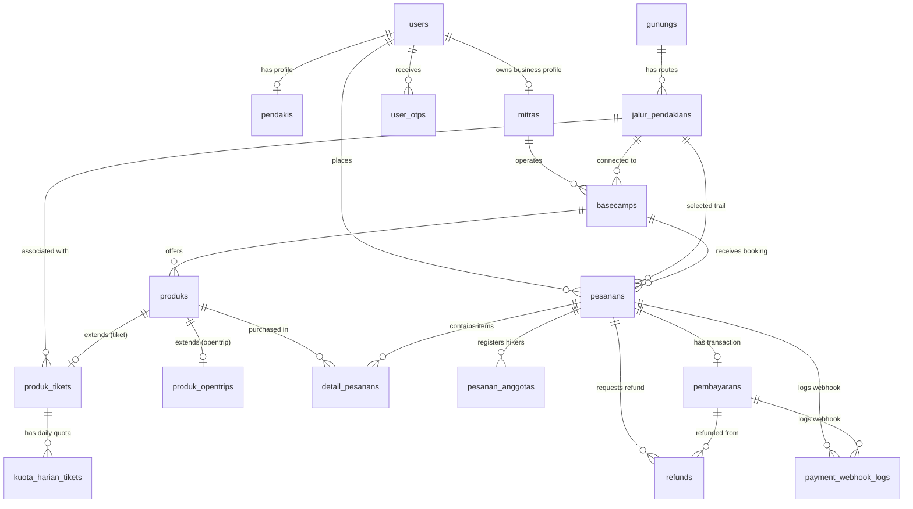

# Technical Specification: Database Schema (`backend/`)

Dokumen spesifikasi teknis ini mendefinisikan skema database komprehensif untuk backend **Summit v2** (`backend/`). Dokumen ini dirancang sebagai acuan berstandar tinggi untuk pengembang dan **AI Agent** agar memahami seluruh entitas, tipe data, relasi antar tabel, batasan (constraints), perhitungan keuangan, dan logika bisnis sistem.

---

## 1. Ringkasan Sistem & Arsitektur Database

- **Database Engine**: MySQL / MariaDB (Laravel 11 ORM / Migration Compatible)
- **Konvensi Penamaan**:
  - Tabel menggunakan format *snake_case* jamak (misal: `users`, `jalur_pendakians`, `detail_pesanans`).
  - Primary Key standar: `id` (`BIGINT UNSIGNED AUTO_INCREMENT`).
  - Foreign Key penamaan: `<nama_entitas_singular>_id` (misal: `user_id`, `pesanan_id`, `produk_id`).
  - Timestamps: `created_at` (`TIMESTAMP`) & `updated_at` (`TIMESTAMP`).

---

## 2. Entity-Relationship Diagram (ERD)



---

## 3. Modul & Klasifikasi Tabel

Database terbagi ke dalam 6 modul utama:

| Modul | Tabel | Deskripsi |
| :--- | :--- | :--- |
| **1. Autentikasi & Core User** | `users`, `user_otps`, `password_reset_tokens`, `sessions`, `personal_access_tokens` | Akun pengguna, enkripsi kata sandi, otentikasi OTP, sesi login & token API Sanctum. |
| **2. Master Destinasi** | `gunungs`, `jalur_pendakians` | Data master gunung, ketinggian MDPL, jalur pendakian, serta tingkat kesulitan. |
| **3. Profil & Kemitraan** | `pendakis`, `mitras`, `basecamps` | Profil verifikasi identitas pendaki, identitas badan/pemilik mitra, serta titik basecamp fisik. |
| **4. Katalog Produk & Stok** | `produks`, `produk_opentrips`, `produk_tikets`, `kuota_harian_tikets` | Inventaris rental, tiket, opentrip, porter/guide, serta kendali kuota harian. |
| **5. Transaksi & Booking** | `pesanans`, `pesanan_anggotas`, `detail_pesanans` | Order booking utama, daftar pendaki/anggota rombongan, serta rincian item belanja. |
| **6. Keuangan & Gateway** | `pembayarans`, `refunds`, `payment_webhook_logs` | Transaksi Payment Gateway, status pembayaran, refund otomatis/manual, dan audit log webhook. |

---

## 4. Kamus Data (Data Dictionary)

### 4.1. Modul Autentikasi & Core User

#### `users`
Menyimpan akun pengguna utama untuk sistem (Admin, Mitra, Pendaki).
| Nama Kolom | Tipe Data | Constraint | Keterangan |
| :--- | :--- | :--- | :--- |
| `id` | `BIGINT UNSIGNED` | `PK, AUTO_INCREMENT` | ID unik pengguna |
| `name` | `VARCHAR(255)` | `NOT NULL` | Nama akun pengguna |
| `email` | `VARCHAR(255)` | `NOT NULL, UNIQUE` | Alamat email utama |
| `email_verified_at` | `TIMESTAMP` | `NULLABLE` | Waktu verifikasi email |
| `password` | `VARCHAR(255)` | `NOT NULL` | Hash password (Bcrypt/Argon2) |
| `role` | `ENUM` | `NOT NULL, DEFAULT 'pendaki'` | Nilai: `'admin'`, `'mitra'`, `'pendaki'` |
| `remember_token` | `VARCHAR(100)` | `NULLABLE` | Token remember-me Laravel |
| `created_at` | `TIMESTAMP` | `NULLABLE` | Waktu pembuatan record |
| `updated_at` | `TIMESTAMP` | `NULLABLE` | Waktu pembaruan record |

#### `user_otps`
Token One-Time Password untuk otentikasi/lupa password.
| Nama Kolom | Tipe Data | Constraint | Keterangan |
| :--- | :--- | :--- | :--- |
| `id` | `BIGINT UNSIGNED` | `PK, AUTO_INCREMENT` | ID OTP |
| `user_id` | `BIGINT UNSIGNED` | `FK -> users.id (CASCADE)` | ID Pengguna |
| `otp` | `VARCHAR(255)` | `NOT NULL` | Kode OTP |
| `is_used` | `TINYINT(1)` | `NOT NULL, DEFAULT 0` | Status penggunaan OTP |
| `expires_at` | `TIMESTAMP` | `NOT NULL` | Tanggal & waktu kadaluarsa |
| `created_at` | `TIMESTAMP` | `NULLABLE` | Waktu pembuatan record |
| `updated_at` | `TIMESTAMP` | `NULLABLE` | Waktu pembaruan record |
* **Index**: `INDEX (user_id, is_used, expires_at)`

#### `password_reset_tokens` & `sessions` & `personal_access_tokens`
Tabel bawaan Laravel Framework untuk manajemen reset password, sesi web browser, dan token API Sanctum (`tokenable_type`, `tokenable_id`, `token`, `abilities`).

---

### 4.2. Modul Master Destinasi

#### `gunungs`
Data master gunung Indonesia.
| Nama Kolom | Tipe Data | Constraint | Keterangan |
| :--- | :--- | :--- | :--- |
| `id` | `BIGINT UNSIGNED` | `PK, AUTO_INCREMENT` | ID Gunung |
| `nama_gunung` | `VARCHAR(255)` | `NOT NULL` | Nama gunung (misal: "Gunung Prau") |
| `deskripsi` | `TEXT` | `NOT NULL` | Deskripsi umum gunung |
| `tinggi_mdpl` | `INT` | `NOT NULL` | Ketinggian puncak gunung (MDPL) |
| `lokasi` | `VARCHAR(255)` | `NOT NULL` | Lokasi administratif/kabupaten |
| `foto` | `VARCHAR(255)` | `NOT NULL` | Path/URL foto gunung |
| `status` | `VARCHAR(255)` | `NOT NULL` | Status operasional gunung |
| `created_at` | `TIMESTAMP` | `NULLABLE` | Waktu pembuatan |
| `updated_at` | `TIMESTAMP` | `NULLABLE` | Waktu pembaruan |

#### `jalur_pendakians`
Jalur-jalur pendakian resmi yang tersedia pada masing-masing gunung.
| Nama Kolom | Tipe Data | Constraint | Keterangan |
| :--- | :--- | :--- | :--- |
| `id` | `BIGINT UNSIGNED` | `PK, AUTO_INCREMENT` | ID Jalur Pendakian |
| `gunung_id` | `BIGINT UNSIGNED` | `FK -> gunungs.id` | Reference ke Gunung |
| `nama_jalur` | `VARCHAR(255)` | `NOT NULL` | Nama jalur (misal: "Via Patak Banteng") |
| `deskripsi` | `TEXT` | `NOT NULL` | Detail karakteristik jalur |
| `titik_awal_mdpl` | `VARCHAR(255)` | `NOT NULL` | Ketinggian titik awal jalur (MDPL) |
| `titik_akhir_mdpl` | `VARCHAR(255)` | `NOT NULL` | Ketinggian titik puncak (MDPL) |
| `waktu_tempuh` | `VARCHAR(255)` | `NOT NULL` | Perkiraan estimasi durasi pendakian |
| `status` | `ENUM` | `NOT NULL, DEFAULT 'open'` | Nilai: `'open'`, `'close'` |
| `panjang_jalur` | `VARCHAR(255)` | `NOT NULL` | Jarak tempuh fisik (misal: "7.5 km") |
| `tingkat_kesulitan`| `ENUM` | `NOT NULL` | Nilai: `'mudah'`, `'sedang'`, `'sulit'`, `'ekstrem'` |
| `created_at` | `TIMESTAMP` | `NULLABLE` | Waktu pembuatan |
| `updated_at` | `TIMESTAMP` | `NULLABLE` | Waktu pembaruan |

---

### 4.3. Modul Profil & Kemitraan

#### `pendakis`
Profil identitas lengkap pendaki untuk persyaratan keselamatan dan perizinan.
| Nama Kolom | Tipe Data | Constraint | Keterangan |
| :--- | :--- | :--- | :--- |
| `id` | `BIGINT UNSIGNED` | `PK, AUTO_INCREMENT` | ID Pendaki |
| `user_id` | `BIGINT UNSIGNED` | `FK -> users.id (UNIQUE, CASCADE)` | 1-to-1 dengan tabel `users` |
| `nama_lengkap` | `VARCHAR(255)` | `NOT NULL` | Nama lengkap sesuai kartu identitas |
| `jenis_identitas` | `ENUM` | `NOT NULL, DEFAULT 'ktp'` | Nilai: `'ktp'`, `'paspor'`, `'sim'`, `'lainnya'` |
| `nomor_identitas` | `VARCHAR(255)` | `NOT NULL, UNIQUE` | NIK KTP / Nomor Paspor / SIM |
| `foto_identitas` | `VARCHAR(255)` | `NOT NULL` | URL/Path foto berkas identitas |
| `tanggal_lahir` | `DATE` | `NOT NULL` | Tanggal lahir |
| `jenis_kelamin` | `ENUM` | `NOT NULL` | Nilai: `'l'`, `'p'` |
| `alamat` | `TEXT` | `NOT NULL` | Alamat domisili lengkap |
| `telepon` | `VARCHAR(255)` | `NOT NULL` | Nomor telepon/WhatsApp aktif |
| `nama_kontak_darurat`| `VARCHAR(255)`| `NOT NULL` | Nama keluarga/kontak darurat |
| `telepon_darurat` | `VARCHAR(255)` | `NOT NULL` | Nomor telepon kontak darurat |
| `hubungan_darurat`| `VARCHAR(255)` | `NOT NULL` | Hubungan dengan kontak darurat |
| `status_verifikasi`| `ENUM` | `NOT NULL, DEFAULT 'belum_mengirimkan'` | Nilai: `'belum_mengirimkan'`, `'pending'`, `'disetujui'`, `'ditolak'` |
| `alasan_penolakan`| `TEXT` | `NULLABLE` | Catatan jika verifikasi KYC ditolak |
| `verified_at` | `TIMESTAMP` | `NULLABLE` | Waktu persetujuan verifikasi |
| `verified_by` | `BIGINT UNSIGNED` | `FK -> users.id (SET NULL)` | ID Admin yang melakukan verifikasi |
| `created_at` | `TIMESTAMP` | `NULLABLE` | Waktu pembuatan record |
| `updated_at` | `TIMESTAMP` | `NULLABLE` | Waktu pembaruan record |

#### `mitras`
Profil pengelola basecamp / mitra penyedia layanan.
| Nama Kolom | Tipe Data | Constraint | Keterangan |
| :--- | :--- | :--- | :--- |
| `id` | `BIGINT UNSIGNED` | `PK, AUTO_INCREMENT` | ID Mitra |
| `user_id` | `BIGINT UNSIGNED` | `FK -> users.id (CASCADE)` | User penanggung jawab mitra |
| `nama_pemilik` | `VARCHAR(255)` | `NOT NULL` | Nama pemilik bisnis / institusi |
| `telepon` | `VARCHAR(255)` | `NOT NULL` | Nomor kontak mitra |
| `alamat` | `TEXT` | `NOT NULL` | Alamat bisnis mitra |
| `deskripsi` | `TEXT` | `NULLABLE` | Deskripsi singkat mengenai mitra |
| `status` | `ENUM` | `NOT NULL, DEFAULT 'aktif'` | Nilai: `'aktif'`, `'suspend'` |
| `npwp` | `VARCHAR(255)` | `NULLABLE, UNIQUE` | Nomor NPWP |
| `nik` | `VARCHAR(255)` | `NOT NULL, UNIQUE` | NIK pemilik usaha |
| `rekening_bank` | `VARCHAR(255)` | `NOT NULL, UNIQUE` | Nomor rekening pencairan |
| `nama_rekening` | `VARCHAR(255)` | `NOT NULL` | Nama pemilik rekening bank |
| `bank` | `VARCHAR(255)` | `NOT NULL` | Nama bank (misal: "BCA", "Mandiri") |
| `ewallet` | `VARCHAR(255)` | `NULLABLE` | Nomor e-wallet alternatif pencairan |
| `created_at` | `TIMESTAMP` | `NULLABLE` | Waktu pembuatan |
| `updated_at` | `TIMESTAMP` | `NULLABLE` | Waktu pembaruan |

#### `basecamps`
Pos / Basecamp fisik pengelolaan pendakian.
| Nama Kolom | Tipe Data | Constraint | Keterangan |
| :--- | :--- | :--- | :--- |
| `id` | `BIGINT UNSIGNED` | `PK, AUTO_INCREMENT` | ID Basecamp |
| `mitra_id` | `BIGINT UNSIGNED` | `FK -> mitras.id (CASCADE)` | Mitra pengelola basecamp |
| `jalur_id` | `BIGINT UNSIGNED` | `FK -> jalur_pendakians.id` | Jalur pendakian yang dikelola |
| `nama_basecamp` | `VARCHAR(255)` | `NOT NULL` | Nama basecamp fisik |
| `longitude` | `VARCHAR(255)` | `NOT NULL` | Koordinat Bujur (GPS) |
| `latitude` | `VARCHAR(255)` | `NOT NULL` | Koordinat Lintang (GPS) |
| `jam_operasional` | `VARCHAR(255)` | `NOT NULL` | Jam buka/tutup basecamp |
| `created_at` | `TIMESTAMP` | `NULLABLE` | Waktu pembuatan |
| `updated_at` | `TIMESTAMP` | `NULLABLE` | Waktu pembaruan |

---

### 4.4. Modul Katalog Produk & Stok

#### `produks`
Tabel induk katalog barang & jasa yang dijual oleh basecamp.
| Nama Kolom | Tipe Data | Constraint | Keterangan |
| :--- | :--- | :--- | :--- |
| `id` | `BIGINT UNSIGNED` | `PK, AUTO_INCREMENT` | ID Produk |
| `basecamp_id` | `BIGINT UNSIGNED` | `FK -> basecamps.id (CASCADE)` | Basecamp penyedia produk |
| `nama_produk` | `VARCHAR(255)` | `NOT NULL` | Nama layanan / item |
| `kategori` | `ENUM` | `NOT NULL` | Nilai: `'ticket'`, `'rental'`, `'opentrip'`, `'guide'`, `'porter'`, `'transport'`, `'parkir'`, `'merchandise'`, `'kuliner'` |
| `deskripsi` | `TEXT` | `NULLABLE` | Deskripsi detail barang/jasa |
| `harga` | `DECIMAL(12,2)` | `NOT NULL` | Harga satuan produk |
| `stok` | `INT` | `NULLABLE` | Stok fisik (jika produk rental/merchandise) |
| `satuan` | `VARCHAR(255)` | `NULLABLE` | Satuan (misal: "hari", "orang", "unit") |
| `is_active` | `TINYINT(1)` | `NOT NULL, DEFAULT 1` | Status keaktifan produk |
| `gambar` | `VARCHAR(255)` | `NULLABLE` | Path/URL foto produk |
| `created_at` | `TIMESTAMP` | `NULLABLE` | Waktu pembuatan |
| `updated_at` | `TIMESTAMP` | `NULLABLE` | Waktu pembaruan |

#### `produk_opentrips`
Detail spesifik untuk produk tipe `opentrip`.
| Nama Kolom | Tipe Data | Constraint | Keterangan |
| :--- | :--- | :--- | :--- |
| `id` | `BIGINT UNSIGNED` | `PK, AUTO_INCREMENT` | ID Opentrip |
| `produk_id` | `BIGINT UNSIGNED` | `FK -> produks.id (CASCADE)` | FK ke produk utama |
| `tanggal_berangkat`| `DATE` | `NOT NULL` | Tanggal mulai trip |
| `tanggal_pulang` | `DATE` | `NOT NULL` | Tanggal selesai trip |
| `meeting_point` | `VARCHAR(255)` | `NOT NULL` | Titik kumpul peserta |
| `minimal_peserta` | `INT` | `NOT NULL, DEFAULT 1` | Kuota kuorum trip |
| `maksimal_peserta` | `INT` | `NOT NULL` | Kapasitas maksimal kuota |
| `sisa_kursi` | `INT` | `NOT NULL` | Sisa kapasitas kursi yang tersedia |
| `created_at` | `TIMESTAMP` | `NULLABLE` | Waktu pembuatan |
| `updated_at` | `TIMESTAMP` | `NULLABLE` | Waktu pembaruan |

#### `produk_tikets`
Detail operasional untuk produk tipe `ticket` (simaksi).
| Nama Kolom | Tipe Data | Constraint | Keterangan |
| :--- | :--- | :--- | :--- |
| `id` | `BIGINT UNSIGNED` | `PK, AUTO_INCREMENT` | ID Tiket |
| `produk_id` | `BIGINT UNSIGNED` | `FK -> produks.id (CASCADE)` | FK ke produk utama |
| `jalur_id` | `BIGINT UNSIGNED` | `FK -> jalur_pendakians.id (CASCADE)` | Jalur spesifik tiket |
| `jam_buka` | `TIME` | `NOT NULL` | Waktu mulai registrasi harian |
| `jam_tutup` | `TIME` | `NOT NULL` | Batas akhir registrasi harian |
| `created_at` | `TIMESTAMP` | `NULLABLE` | Waktu pembuatan |
| `updated_at` | `TIMESTAMP` | `NULLABLE` | Waktu pembaruan |

#### `kuota_harian_tikets`
Kendali batas kuota pendaki harian untuk produk tiket.
| Nama Kolom | Tipe Data | Constraint | Keterangan |
| :--- | :--- | :--- | :--- |
| `id` | `BIGINT UNSIGNED` | `PK, AUTO_INCREMENT` | ID Kuota Harian |
| `produk_tiket_id` | `BIGINT UNSIGNED` | `FK -> produk_tikets.id (CASCADE)` | FK ke produk tiket |
| `tanggal` | `DATE` | `NOT NULL` | Tanggal kuota |
| `kuota_total` | `INT` | `NOT NULL` | Total kuota yang disediakan |
| `kuota_tersisa` | `INT` | `NOT NULL` | Kuota yang masih tersedia |
| `created_at` | `TIMESTAMP` | `NULLABLE` | Waktu pembuatan |
| `updated_at` | `TIMESTAMP` | `NULLABLE` | Waktu pembaruan |
* **Constraint Unik**: `UNIQUE (produk_tiket_id, tanggal)`

---

### 4.5. Modul Transaksi & Booking

#### `pesanans`
Header utama dokumen pemesanan (Order Header).
| Nama Kolom | Tipe Data | Constraint | Keterangan |
| :--- | :--- | :--- | :--- |
| `id` | `BIGINT UNSIGNED` | `PK, AUTO_INCREMENT` | ID Pesanan |
| `invoice` | `VARCHAR(255)` | `NOT NULL, UNIQUE` | Kode Invoice unik (misal: "INV/20260705/0001") |
| `user_id` | `BIGINT UNSIGNED` | `FK -> users.id (CASCADE)` | Pendaki yang memesan |
| `basecamp_id` | `BIGINT UNSIGNED` | `FK -> basecamps.id (CASCADE)`| Basecamp tujuan booking |
| `jalur_id` | `BIGINT UNSIGNED` | `FK -> jalur_pendakians.id (CASCADE)`| Jalur pendakian yang dipesan |
| `status` | `ENUM` | `NOT NULL, DEFAULT 'pending'` | Nilai: `'pending'`, `'paid'`, `'expired'`, `'failed'`, `'cancelled'`, `'refunded'` |
| `subtotal` | `DECIMAL(15,2)` | `NOT NULL` | Total harga seluruh item sebelum potongan/biaya |
| `tanggal_booking` | `DATE` | `NOT NULL` | Tanggal rencana pendakian |
| `diskon` | `DECIMAL(15,2)` | `NOT NULL, DEFAULT 0.00` | Potongan harga/promo |
| `biaya_layanan_user`| `DECIMAL(15,2)`| `NOT NULL, DEFAULT 0.00` | Platform fee yang ditanggung pembeli |
| `komisi_admin` | `DECIMAL(15,2)` | `NOT NULL, DEFAULT 0.00` | Komisi potongan platform untuk Admin |
| `pendapatan_mitra` | `DECIMAL(15,2)` | `NOT NULL, DEFAULT 0.00` | Hak alokasi dana bersih untuk Mitra |
| `total_bayar` | `DECIMAL(15,2)` | `NOT NULL` | Total tagihan akhir yang wajib dibayar pembeli |
| `created_at` | `TIMESTAMP` | `NULLABLE` | Waktu booking dibuat |
| `updated_at` | `TIMESTAMP` | `NULLABLE` | Waktu pembaruan status |

#### `pesanan_anggotas`
Daftar seluruh anggota rombongan pendakian yang didaftarkan pada order.
| Nama Kolom | Tipe Data | Constraint | Keterangan |
| :--- | :--- | :--- | :--- |
| `id` | `BIGINT UNSIGNED` | `PK, AUTO_INCREMENT` | ID Anggota |
| `pesanan_id` | `BIGINT UNSIGNED` | `FK -> pesanans.id (CASCADE)`| Reference ke pesanan utama |
| `nama_anggota` | `VARCHAR(255)` | `NOT NULL` | Nama lengkap anggota pendaki |
| `nik_identitas` | `VARCHAR(255)` | `NOT NULL` | NIK/Nomor Identitas anggota |
| `telepon` | `VARCHAR(255)` | `NULLABLE` | Nomor telepon anggota |
| `telepon_darurat` | `VARCHAR(255)` | `NULLABLE` | Kontak darurat anggota |
| `hubungan_darurat`| `VARCHAR(255)` | `NULLABLE` | Hubungan kontak darurat |
| `created_at` | `TIMESTAMP` | `NULLABLE` | Waktu pembuatan |
| `updated_at` | `TIMESTAMP` | `NULLABLE` | Waktu pembaruan |

#### `detail_pesanans`
Item-item spesifik yang dibeli dalam 1 nomor pesanan.
| Nama Kolom | Tipe Data | Constraint | Keterangan |
| :--- | :--- | :--- | :--- |
| `id` | `BIGINT UNSIGNED` | `PK, AUTO_INCREMENT` | ID Detail Pesanan |
| `pesanan_id` | `BIGINT UNSIGNED` | `FK -> pesanans.id (CASCADE)`| Reference ke pesanan |
| `produk_id` | `BIGINT UNSIGNED` | `FK -> produks.id (CASCADE)` | Reference ke katalog produk |
| `qty` | `INT` | `NOT NULL` | Kuantitas item |
| `harga` | `DECIMAL(15,2)` | `NOT NULL` | Harga satuan saat transaksi |
| `subtotal` | `DECIMAL(15,2)` | `NOT NULL` | `qty * harga` |
| `status_operasional`| `ENUM` | `NOT NULL, DEFAULT 'pending'` | Nilai: `'pending'`, `'ready'`, `'active'`, `'completed'`, `'cancelled'` |
| `kode_tiket` | `VARCHAR(255)` | `NULLABLE, UNIQUE` | Kode unik e-ticket / QR Code scan |
| `created_at` | `TIMESTAMP` | `NULLABLE` | Waktu pembuatan |
| `updated_at` | `TIMESTAMP` | `NULLABLE` | Waktu pembaruan |

---

### 4.6. Modul Keuangan & Gateway

#### `pembayarans`
Transaksi pembayaran yang diproses via Payment Gateway (misal: Xendit, Duitku).
| Nama Kolom | Tipe Data | Constraint | Keterangan |
| :--- | :--- | :--- | :--- |
| `id` | `BIGINT UNSIGNED` | `PK, AUTO_INCREMENT` | ID Pembayaran |
| `pesanan_id` | `BIGINT UNSIGNED` | `FK -> pesanans.id (CASCADE)`| Reference ke pesanan |
| `metode` | `ENUM` | `NULLABLE` | Nilai: `'transfer'`, `'ewallet'`, `'qris'`, `'manual'` |
| `provider` | `VARCHAR(255)` | `NULLABLE` | Nama Payment Gateway / Merchant |
| `reference_id` | `VARCHAR(255)` | `NULLABLE, UNIQUE` | Transaction ID resmi dari Gateway |
| `checkout_url` | `TEXT` | `NULLABLE` | URL pembayaran / Snap Redirection |
| `amount` | `DECIMAL(15,2)` | `NOT NULL, DEFAULT 0.00` | Tagihan pembayaran pada sesi ini |
| `paid_amount` | `DECIMAL(15,2)` | `NULLABLE` | Realisasi dana yang diterima via webhook |
| `status` | `ENUM` | `NOT NULL, DEFAULT 'pending'` | Nilai: `'pending'`, `'success'`, `'expired'`, `'failed'`, `'cancelled'` |
| `biaya_gateway` | `DECIMAL(15,2)` | `NOT NULL, DEFAULT 0.00` | Potongan MDR / transaksi PG |
| `raw_response` | `JSON` | `NULLABLE` | Payload JSON respon awal gateway |
| `paid_at` | `DATETIME` | `NULLABLE` | Tanggal & jam pelunasan |
| `expired_at` | `DATETIME` | `NULLABLE` | Batas tenggat waktu pembayaran |
| `created_at` | `TIMESTAMP` | `NULLABLE` | Waktu pembuatan sesi bayar |
| `updated_at` | `TIMESTAMP` | `NULLABLE` | Waktu pembaruan |

#### `refunds`
Pencatatan dan eksekusi pengembalian dana transaksi.
| Nama Kolom | Tipe Data | Constraint | Keterangan |
| :--- | :--- | :--- | :--- |
| `id` | `BIGINT UNSIGNED` | `PK, AUTO_INCREMENT` | ID Refund |
| `pesanan_id` | `BIGINT UNSIGNED` | `FK -> pesanans.id (CASCADE)`| Order yang direfund |
| `pembayaran_id` | `BIGINT UNSIGNED` | `FK -> pembayarans.id (CASCADE)`| Sesi bayar yang direfund |
| `reference_refund_id`| `VARCHAR(255)`| `NULLABLE, UNIQUE` | Reference ID refund dari PG |
| `tipe` | `ENUM` | `NOT NULL, DEFAULT 'auto'` | Nilai: `'auto'`, `'manual'` |
| `nominal` | `DECIMAL(15,2)` | `NOT NULL` | Jumlah dana yang dikembalikan |
| `alasan` | `TEXT` | `NOT NULL` | Alasan pembatalan/refund |
| `status` | `ENUM` | `NOT NULL, DEFAULT 'pending'` | Nilai: `'pending'`, `'success'`, `'failed'` |
| `bank_tujuan` | `VARCHAR(255)` | `NULLABLE` | Bank tujuan refund manual |
| `rekening_tujuan` | `VARCHAR(255)` | `NULLABLE` | Nomor rekening tujuan |
| `nama_tujuan` | `VARCHAR(255)` | `NULLABLE` | Nama penerima refund |
| `bukti_transfer` | `VARCHAR(255)` | `NULLABLE` | Lampiran foto bukti transfer |
| `raw_response` | `JSON` | `NULLABLE` | Log respon JSON PG |
| `refunded_at` | `DATETIME` | `NULLABLE` | Waktu dana berhasil terkirim |
| `created_at` | `TIMESTAMP` | `NULLABLE` | Waktu permohonan dibuat |
| `updated_at` | `TIMESTAMP` | `NULLABLE` | Waktu pembaruan |

#### `payment_webhook_logs`
Audit trail log callback/webhook dari penyedia Payment Gateway.
| Nama Kolom | Tipe Data | Constraint | Keterangan |
| :--- | :--- | :--- | :--- |
| `id` | `BIGINT UNSIGNED` | `PK, AUTO_INCREMENT` | ID Log Webhook |
| `pesanan_id` | `BIGINT UNSIGNED` | `FK -> pesanans.id (SET NULL)`| Relation opsional ke Pesanan |
| `pembayaran_id` | `BIGINT UNSIGNED` | `FK -> pembayarans.id (SET NULL)`| Relation opsional ke Pembayaran |
| `provider` | `VARCHAR(255)` | `NULLABLE` | Provider gateway (misal: "xendit") |
| `event` | `VARCHAR(255)` | `NULLABLE` | Jenis event webhook (misal: "invoice.paid") |
| `external_id` | `VARCHAR(255)` | `NULLABLE` | Reference ID dari callback |
| `status_raw` | `VARCHAR(255)` | `NULLABLE` | Raw status string dari webhook |
| `payload` | `JSON` | `NOT NULL` | Seluruh payload JSON mentah |
| `ip_address` | `VARCHAR(255)` | `NULLABLE` | Alamat IP pengirim callback |
| `is_valid` | `TINYINT(1)` | `NOT NULL, DEFAULT 0` | Hasil verifikasi Signature Token |
| `error_message` | `TEXT` | `NULLABLE` | Pesan error jika callback gagal diproses |
| `created_at` | `TIMESTAMP` | `NULLABLE` | Tanggal callback masuk |
| `updated_at` | `TIMESTAMP` | `NULLABLE` | Waktu pembaruan log |

---

## 5. Formula Keuangan & Alur Status

### 5.1. Rumus Komputasi `pesanans`
$$ \text{subtotal} = \sum (\text{detail\_pesanans.qty} \times \text{detail\_pesanans.harga}) $$
$$ \text{total\_bayar} = \text{subtotal} - \text{diskon} + \text{biaya\_layanan\_user} $$
$$ \text{pendapatan\_mitra} = \text{subtotal} - \text{diskon} - \text{komisi\_admin} $$

*Keterangan*:
- `biaya_layanan_user`: Biaya tambahan platform yang dibayar langsung oleh pendaki.
- `komisi_admin`: Potongan bagi hasil yang diambil sistem dari omset bruto transaksi basecamp.
- `pendapatan_mitra`: Nilai bersih yang berhak dicairkan oleh Mitra.

### 5.2. Siklus Status Pembayaran & Pesanan

```
[Pesanan Created] -> status: 'pending', pembayarans.status: 'pending'
       |
       +---> [Webhook Success] ----> status: 'paid', pembayarans.status: 'success'
       |                                   |
       |                                   +---> [Request Refund] -> status: 'refunded', refunds.status: 'success'
       |
       +---> [Expired / Timeout] --> status: 'expired', pembayarans.status: 'expired'
       |
       +---> [User Cancelled] -----> status: 'cancelled', pembayarans.status: 'cancelled'
       |
       +---> [Payment Failed] -----> status: 'failed', pembayarans.status: 'failed'
```

---

## 6. Panduan Pengembangan untuk AI Agent

Saat AI Agent melakukan tugas refactoring, penambahan API, atau modifikasi skema database pada `backend/`, ikuti panduan berikut:

1. **Integritas Constraint & Cascading Deletes**:
   - Menghapus record `users` akan otomatis menghapus record pada `pendakis`, `mitras`, `user_otps`, dan `pesanans` via `CASCADE`.
   - Menghapus `pesanans` akan menghapus `pesanan_anggotas`, `detail_pesanans`, `pembayarans`, dan `refunds`.
   - Record `payment_webhook_logs` menggunakan `SET NULL` saat parent `pesanans` atau `pembayarans` dihapus agar audit log tetap tersimpan.

2. **Model Eloquent Alignment**:
   - Selalu periksa properti `protected $table` dan `casts()` pada class Model di `backend/app/Models/` (misal `Pesanan.php`, `Pembayaran.php`).
   - Gunakan atribut PHP 8 `#[Fillable(...)]` saat menambahkan kolom baru yang diperbolehkan untuk mass-assignment.

3. **Integritas Kuota Harian (`kuota_harian_tikets`)**:
   - Kuota tiket bersifat sensitif terhadap *race condition*. Setiap pengurangan `kuota_tersisa` wajib dibungkus dalam **Database Transaction** (`DB::transaction`) dan menggunakan locking row (`lockForUpdate()`).

4. **Presisi Decimal**:
   - Semua angka nominal keuangan (`harga`, `subtotal`, `diskon`, `biaya_layanan_user`, `komisi_admin`, `pendapatan_mitra`, `total_bayar`, `amount`, `paid_amount`, `nominal`) **WAJIB** menggunakan tipe data `DECIMAL` dan di-cast sebagai `decimal:2` di Model Laravel. Jangan pernah meggunakan `FLOAT` atau `DOUBLE` untuk perhitungan transaksi keuangan.
