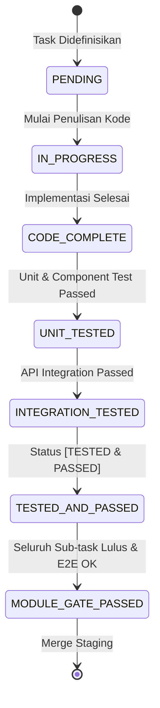

# TASK LIST & WBS: FRONTEND WEB PORTAL ROLE ADMIN

Dokumen ini memuat Work Breakdown Structure (WBS), spesifikasi antarmuka komponen, kontrak TypeScript, dan sistem verifikasi kualitas bertingkat (*Quality Checklist & Gate System*) untuk implementasi **Frontend Web Portal Role Admin** pada platform **Summit v2** (`frontend/`).

---

## 🛠️ Stack & Standar Arsitektur Frontend
- **Framework & Core**: Vue 3 (Composition API, `<script setup>`), TypeScript Strict Mode, Vite
- **UI Components & Styling**: Tailwind CSS, shadcn-vue (Radix Vue primitives), Lucide Icons
- **State Management & Caching**: Pinia, VueUse (`useFetch` / Axios + TanStack Query Adapter)
- **Table & Data Grid**: `@tanstack/vue-table` (Server-side pagination, multi-sort, dynamic filters)
- **Routing & Auth Guard**: Vue Router (Navigation guards with role verification & token expiration checks)
- **API Target**: `http://localhost:8000/api/v1`

---

## 📈 Ringkasan Progres Implementasi Frontend Admin

- [x] **Modul 00: Foundation, Auth Session & Global Infrastructure** (3/3 Task Selesai — **100%**)
- [x] **Modul 01: Verifikasi & Manajemen KYC Pendaki** (4/4 Task Selesai — **100%**)
- [x] **Modul 02: Master Destinasi — Gunung & Jalur Pendakian** (4/4 Task Selesai — **100%**)
- [ ] **Modul 03: Master Kemitraan — Mitra & Pemetaan Basecamp** (0/3 Task Selesai — **0%**)
- [ ] **Modul 04: Monitoring Produk & Kuota Harian Basecamp** (0/2 Task Selesai — **0%**)
- [ ] **Modul 05: Operasional Finansial — Escrow, Payout & Refund** (0/4 Task Selesai — **0%**)
- [ ] **Modul 06: Ads & Monetization Banner Management** (0/3 Task Selesai — **0%**)

**Total Progres Frontend Admin**: **11 / 23 Task Selesai (48%)**

---

## 🧱 [MODUL 00: FOUNDATION, AUTH SESSION & GLOBAL INFRASTRUCTURE]
Status Modul: `[x] Completed` | `[x] Module Verification Passed`

Modul fondasi arsitektur frontend, sistem state otentikasi admin, layout dashboard responsif, dan HTTP interceptor layer dengan *error normalization*.

#### Task Breakdown:
- [x] **Task 0.1: HTTP Client & Response Normalizer Adapter**
  - [x] Implementasi Kode Selesai:
    - Inisialisasi Axios instance dengan `baseURL: /api/v1` dan `withCredentials: true`
    - Request interceptor: Sematkan `Authorization: Bearer <token>`
    - Response adapter: Normalisasi paginasi ganda backend (`data.data` -> `items`, `data.meta` -> `meta`)
    - Error interceptor: Mapping RFC 7807/Laravel 422 errors ke form states, auto redirect on 401
  - [x] Unit/Component Test Passed
  - [x] Integration Test (Hit `POST /api/v1/auth/login` & `GET /api/v1/profile`) Passed
  - Status: `[TESTED & PASSED]`

- [x] **Task 0.2: Pinia Auth Store & Role Navigation Guards**
  - [x] Implementasi Kode Selesai:
    - `useAuthStore` (login, logout, refresh profile, active user state)
    - Vue Router navigation guard: Cegah akses non-admin (`role !== 'admin'`)
    - Storage synchronization (Local storage fallback / HttpOnly cookie handling)
  - [x] Unit/Component Test Passed
  - [x] Integration Test (Login session persistence & logout flow) Passed
  - Status: `[TESTED & PASSED]`

- [x] **Task 0.3: Admin Layout & Core UI Shell**
  - [x] Implementasi Kode Selesai:
    - Sidebar navigasi modular dengan status badge & collapsible menu
    - Top header (User profile menu, breadcrumbs, notification trigger, theme toggle)
    - Reusable Base Components: `DataTable`, `PaginationBar`, `ConfirmModal`, `EmptyState`, `SkeletonTable`, `MetricCard`
  - [x] Unit/Component Test Passed
  - [x] Integration Test (Render and responsive navigation) Passed
  - Status: `[TESTED & PASSED]`

#### Module-Level Acceptance Gate:
- [x] Seluruh sub-task Modul 00 berstatus `[TESTED & PASSED]`
- [x] Sesi login admin terproteksi, token otomatis terinjeksi di seluruh request
- [x] Penanganan global error 401/403/500 menampilkan toast/modal dialog sesuai standar
- [x] Modul siap di-merge ke branch staging

---

## 🪪 [MODUL 01: VERIFIKASI & MANAJEMEN KYC PENDAKI]
Status Modul: `[x] Completed` | `[x] Module Verification Passed`

Modul verifikasi identitas resmi pendaki (KTP/Paspor) untuk pemenuhan regulasi keamanan pendakian.

#### Task Breakdown:
- [x] **Task 1.1: KYC API Service Layer & TypeScript Types**
  - [x] Implementasi Kode Selesai:
    - Interface: `KycProfile`, `VerifyKycPayload`, `KycFilterParams`
    - Service `kycService.ts` (`getAllKyc(params)`, `getKycById(id)`, `verifyKyc(id, payload)`, `fetchDocumentBlob(id)`)
  - [x] Unit/Component Test Passed
  - [x] Integration Test (Hit `GET /api/v1/admin/kyc`) Passed
  - Status: `[TESTED & PASSED]`

- [x] **Task 1.2: KYC Data Table & Server-Side Filtering**
  - [x] Implementasi Kode Selesai:
    - Tab filter status cepat: `Semua`, `Menunggu Verifikasi (Pending)`, `Disetujui`, `Ditolak`
    - Server-side search & pagination controls
    - Kolom data: ID, Nama Lengkap, Jenis & No Identitas, Tanggal Pengajuan, Status Badge, Aksi
  - [x] Unit/Component Test Passed
  - [x] Integration Test (Hit `GET /api/v1/admin/kyc?status=pending&page=1`) Passed
  - Status: `[TESTED & PASSED]`

- [x] **Task 1.3: Secure KYC Document Preview Hook & Modal**
  - [x] Implementasi Kode Selesai:
    - Composable `useSecureDocument(kycId)` untuk fetch binary stream dengan auth headers dan render Blob URL
    - Modal visualisasi dokumen (Zoom in, Zoom out, Rotate, Fullscreen preview KTP/Paspor)
    - Fallback error state jika dokumen korup atau hilang di storage privat
  - [x] Unit/Component Test Passed
  - [x] Integration Test (Hit `GET /api/v1/admin/kyc/{id}/download-document`) Passed
  - Status: `[TESTED & PASSED]`

- [x] **Task 1.4: Approval & Rejection Workflow Handler**
  - [x] Implementasi Kode Selesai:
    - Modal dialog aksi Verifikasi
    - Quick Action: **Setujui (Approve)** dengan konfirmasi sekunder
    - Action **Tolak (Reject)** dengan input wajib `alasan_penolakan` (Textarea dengan validasi min 10 karakter)
    - Cache invalidation & update status data table seketika tanpa full reload
  - [x] Unit/Component Test Passed
  - [x] Integration Test (Hit `POST /api/v1/admin/kyc/{id}/verify`) Passed
  - Status: `[TESTED & PASSED]`

#### Module-Level Acceptance Gate:
- [x] Seluruh sub-task Modul 01 berstatus `[TESTED & PASSED]`
- [x] End-to-End User Flow (Admin buka list KYC -> Filter pending -> Buka dokumen modal -> Approve/Reject dengan alasan -> Status berubah) teruji tanpa cacat
- [x] Proteksi dokumen identitas terverifikasi aman (No direct public URL leak)
- [x] Modul siap di-merge ke branch staging

---

## ⛰️ [MODUL 02: MASTER DESTINASI — GUNUNG & JALUR PENDAKIAN]
Status Modul: `[x] Completed` | `[x] Module Verification Passed`

Modul pengelolaan direktori gunung nasional, jalur pendakian resmi, dan kontrol status operasional jalur.

#### Task Breakdown:
- [x] **Task 2.1: Mountain & Trail API Service & Stores**
  - [x] Implementasi Kode Selesai:
    - TypeScript definitions: `Gunung`, `JalurPendakian`, `CreateGunungPayload`, `CreateJalurPayload`
    - Service `mountainService.ts` & `trailService.ts`
  - [x] Unit/Component Test Passed
  - [x] Integration Test (Hit Mountain & Trail API endpoints) Passed
  - Status: `[TESTED & PASSED]`

- [x] **Task 2.2: Mountain Catalog Management UI**
  - [x] Implementasi Kode Selesai:
    - Grid & Table view katalog gunung dengan indikator ketinggian (MDPL) dan jumlah jalur aktif
    - Modal Create & Edit Gunung dengan preview image upload (`multipart/form-data` dengan `_method=PUT` spoofing)
    - Modal konfirmasi Delete gunung dengan peringatan relasi jalur
  - [x] Unit/Component Test Passed
  - [x] Integration Test (Hit `POST /api/v1/admin/mountains` & `DELETE /api/v1/admin/mountains/{id}`) Passed
  - Status: `[TESTED & PASSED]`

- [x] **Task 2.3: Trail (Jalur Pendakian) Data Table & Filter**
  - [x] Implementasi Kode Selesai:
    - Data Table dengan filter multi-parameter: `gunung_id`, `status` (open/close), `tingkat_kesulitan`, `search`
    - Kolom: Nama Jalur, Gunung, Titik Awal/Akhir MDPL, Estimasi Waktu, Kesulitan, Status Operasional, Aksi
    - Quick Toggle Switch untuk ubah status Buka/Tutup seketika
  - [x] Unit/Component Test Passed
  - [x] Integration Test (Hit `GET /api/v1/admin/trails` & `PATCH /api/v1/admin/trails/{id}/status`) Passed
  - Status: `[TESTED & PASSED]`

- [x] **Task 2.4: Trail Create & Edit Form Modal**
  - [x] Implementasi Kode Selesai:
    - Form dialog validasi: Gunung Induk (Select searchable), Nama Jalur, MDPL Awal/Akhir, Waktu Tempuh, Tingkat Kesulitan
    - Handling response error validasi 422 terikat ke masing-masing input field
  - [x] Unit/Component Test Passed
  - [x] Integration Test (Hit `POST /api/v1/admin/trails` & `PUT /api/v1/admin/trails/{id}`) Passed
  - Status: `[TESTED & PASSED]`

#### Module-Level Acceptance Gate:
- [x] Seluruh sub-task Modul 02 berstatus `[TESTED & PASSED]`
- [x] End-to-End User Flow (Admin tambah gunung baru -> Tambah jalur pada gunung tersebut -> Buka/tutup status jalur) teruji sukses
- [x] Form multipart upload foto gunung teruji pada skenario create maupun update
- [x] Modul siap di-merge ke branch staging

---

## 🤝 [MODUL 03: MASTER KEMITRAAN — MITRA & PEMETAAN BASECAMP]
Status Modul: `[x] Completed` | `[x] Module Verification Passed`

Modul tata kelola data mitra pengelola basecamp, pembuatan akun akses mitra, dan pemetaan basecamp operasional ke jalur pendakian.

#### Task Breakdown:
- [x] **Task 3.1: Partner (Mitra) Management & Account Provisioning**
  - [x] Implementasi Kode Selesai:
    - Service `src/api/partner.ts` & Types `src/types/partner.ts`
    - Data Table Mitra (Nama Pemilik, Akun Email, Telepon, Status, Data Rekening Bank/E-Wallet)
    - Modal Create Mitra: Pembuatan akun auth login (`email`, `password`) sekaligus profil bisnis dalam 1 form terpadu
    - Modal Edit Mitra & Status Switcher (`aktif` / `suspend`)
  - [x] Unit/Component Test Passed
  - [x] Integration Test (Hit `GET /api/v1/admin/partners` & `POST /api/v1/admin/partners`) Passed
  - Status: `[TESTED & PASSED]`

- [x] **Task 3.2: Basecamp Directory & Trail Mapping**
  - [x] Implementasi Kode Selesai:
    - Service `src/api/basecamp.ts` & Types `src/types/basecamp.ts`
    - Data Table Basecamp: Nama Basecamp, Mitra Pengelola, Jalur Terkait, Koordinat GPS, Jam Operasional
    - Modal Form Create & Edit Basecamp (Dropdown dinamis Mitra & Jalur, Input Lat/Long, Jam Buka/Tutup)
  - [x] Unit/Component Test Passed
  - [x] Integration Test (Hit `GET /api/v1/admin/basecamps` & `POST /api/v1/admin/basecamps`) Passed
  - Status: `[TESTED & PASSED]`

- [x] **Task 3.3: Partner & Basecamp Detail Drawer / View**
  - [x] Implementasi Kode Selesai:
    - Side Drawer detail informasi mitra (Daftar basecamp yang dikelola, riwayat rekening, total staf terdaftar)
    - Modal konfirmasi Delete mitra (Validasi cascading dependency)
  - [x] Unit/Component Test Passed
  - [x] Integration Test (Hit `GET /api/v1/admin/partners/{id}`) Passed
  - Status: `[TESTED & PASSED]`

#### Module-Level Acceptance Gate:
- [x] Seluruh sub-task Modul 03 berstatus `[TESTED & PASSED]`
- [x] End-to-End User Flow (Daftarkan Mitra baru -> Akun login ter-create -> Petakan Basecamp baru ke Jalur Gunung) teruji tanpa error foreign key
- [x] Modul siap di-merge ke branch staging

---

## 📦 [MODUL 04: MONITORING PRODUK & KUOTA HARIAN BASECAMP]
Status Modul: `[x] Completed` | `[x] Module Verification Passed`

Modul supervisi dan monitoring katalog produk (tiket pendakian, paket open trip, alat sewa, porter/guide) berbasis pengelompokan Mitra & Basecamp terpadu.

#### Task Breakdown:
- [x] **Task 4.1: Cross-Basecamp Product Monitoring Table & Partner Catalog**
  - [x] Implementasi Kode Selesai:
    - Service `product.ts` & types `types/product.ts`
    - View `ProductListView.vue` dengan Dual View Toggle: **Katalog Berbasis Mitra (Grouped Grid)** & **Tabel Data (List View)**
    - Multi-parameter filter: `search`, `mitra_id`, `kategori`, `is_active`
    - Kolom: Nama Produk, Mitra Pengelola, Basecamp & Jalur, Kategori, Harga/Satuan, Stok/Kuota, Status
  - [x] Unit/Component Test Passed
  - [x] Integration Test (Hit `GET /api/v1/admin/products`) Passed
  - Status: `[TESTED & PASSED]`

- [x] **Task 4.2: Product Details & Daily Quota Inspector**
  - [x] Implementasi Kode Selesai:
    - Modal/Drawer detail produk `ProductDetailInspectorModal.vue`: Rincian kuota harian tiket, jadwal open trip, spesifikasi sewa alat, dan profil mitra pengelola
  - [x] Unit/Component Test Passed
  - [x] Integration Test (Hit `GET /api/v1/admin/products/{id}`) Passed
  - Status: `[TESTED & PASSED]`

#### Module-Level Acceptance Gate:
- [x] Seluruh sub-task Modul 04 berstatus `[TESTED & PASSED]`
- [x] Monitoring kuota tiket dan ketersediaan logistik mitra berfungsi secara real-time dan terpisah rapi per mitra
- [x] Modul siap di-merge ke branch staging

---

## 💰 [MODUL 05: OPERASIONAL FINANSIAL — ESCROW, PAYOUT & REFUND]
Status Modul: `[ ] In Progress` | `[ ] Module Verification Passed`

Modul audit keuangan platform, persetujuan penarikan dana mitra (disbursement payout), dan eksekusi pengembalian dana (refund).

#### Task Breakdown:
- [ ] **Task 5.1: Financial Services & Ledger Types**
  - [ ] Implementasi Kode Selesai:
    - Interface: `EscrowLedger`, `WithdrawalRequest`, `RefundRequest`
    - Service `financeService.ts` (`fetchEscrowLedger`, `fetchWithdrawals`, `approveWithdrawal`, `rejectWithdrawal`, `processRefund`)
  - [ ] Unit/Component Test Passed
  - [ ] Integration Test (Hit Finance API endpoints) Passed
  - Status: `[PENDING]`

- [ ] **Task 5.2: Mitra Withdrawal Review & Approval Dashboard**
  - [ ] Implementasi Kode Selesai:
    - Data Table pengajuan penarikan dana dengan status badge (`pending`, `approved`, `completed`, `rejected`)
    - Modal verifikasi rekening tujuan bank mitra
    - Action Dialog: Approve (Trigger Xendit Payout) & Reject (Input alasan penolakan wajib)
  - [ ] Unit/Component Test Passed
  - [ ] Integration Test (Hit `POST /api/v1/admin/withdrawals/{id}/approve`) Passed
  - Status: `[PENDING]`

- [ ] **Task 5.3: Refund Processing & Dispute Manager**
  - [ ] Implementasi Kode Selesai:
    - Data Table klaim refund akibat penutupan jalur/force majeure
    - Modal review dokumen pendukung refund & nominal kalkulasi
    - Form eksekusi refund (Opsi metode: Auto Payment Gateway / Manual Bank Transfer)
  - [ ] Unit/Component Test Passed
  - [ ] Integration Test (Hit `POST /api/v1/admin/refunds/{id}/process`) Passed
  - Status: `[PENDING]`

- [ ] **Task 5.4: Escrow Holding vs Available Balance Monitor**
  - [ ] Implementasi Kode Selesai:
    - Ringkasan metrik Total Saldo Tertahan (Escrow) vs Saldo Siap Cair (Available)
    - Mutasi transaksi ledger platform
  - [ ] Unit/Component Test Passed
  - [ ] Integration Test Passed
  - Status: `[PENDING]`

#### Module-Level Acceptance Gate:
- [ ] Seluruh sub-task Modul 05 berstatus `[TESTED & PASSED]`
- [ ] Alur approval penarikan saldo dan validasi nominal presisi desimal 2 angka di belakang koma teruji tanpa floating point issue
- [ ] Modul siap di-merge ke branch staging

---

## 📢 [MODUL 06: ADS & MONETIZATION BANNER MANAGEMENT]
Status Modul: `[ ] In Progress` | `[ ] Module Verification Passed`

Modul penempatan banner promosi sponsor/mitra dan monitoring performa klik/impresi iklan.

#### Task Breakdown:
- [ ] **Task 6.1: Banner Ads Service & Table UI**
  - [ ] Implementasi Kode Selesai:
    - Service `adService.ts`
    - Data Table slot banner iklan: Judul, Posisi Slot (`home_top`, `mountain_detail`, `search_sidebar`), Periode Tayang, Status Aktif, Statistik Impresi & Klik, CTR (%)
  - [ ] Unit/Component Test Passed
  - [ ] Integration Test (Hit `GET /api/v1/admin/ads/banners`) Passed
  - Status: `[PENDING]`

- [ ] **Task 6.2: Create & Edit Banner Ad Modal**
  - [ ] Implementasi Kode Selesai:
    - Form upload gambar banner (Validasi dimensi & max 2MB)
    - Date range picker (Tanggal Mulai & Selesai tayang dengan validasi tanggal selesai >= tanggal mulai)
    - Input URL Deep Link / External Link
  - [ ] Unit/Component Test Passed
  - [ ] Integration Test (Hit `POST /api/v1/admin/ads/banners` & `POST /api/v1/admin/ads/banners/{id}`) Passed
  - Status: `[PENDING]`

- [ ] **Task 6.3: Banner Slot Delete & Toggle Active**
  - [ ] Implementasi Kode Selesai:
    - Quick switch active/inactive
    - Modal delete slot iklan dengan invalidasi cache banner publik
  - [ ] Unit/Component Test Passed
  - [ ] Integration Test (Hit `DELETE /api/v1/admin/ads/banners/{id}`) Passed
  - Status: `[PENDING]`

#### Module-Level Acceptance Gate:
- [ ] Seluruh sub-task Modul 06 berstatus `[TESTED & PASSED]`
- [ ] Pengaturan tanggal tayang dan kalkulasi CTR analytics teruji akurat
- [ ] Modul siap di-merge ke branch staging

---

## 🎯 Aturan Eksekusi Task & Status Workflow

