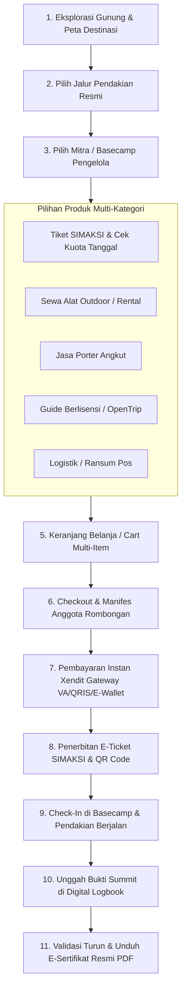
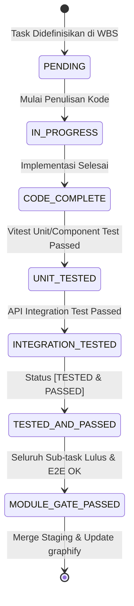

# TASK LIST & WBS: FRONTEND WEB PORTAL ROLE PENDAKI (E-COMMERCE MARKETPLACE)

Dokumen ini memuat Work Breakdown Structure (WBS), spesifikasi antarmuka komponen, kontrak TypeScript, dan sistem verifikasi kualitas bertingkat (*Quality Checklist & Gate System*) untuk implementasi **Frontend Web Portal Role Pendaki (Climber E-Commerce Marketplace)** pada platform **Summit v2** (`frontend/`).

---

## 🛠️ Stack & Standar Arsitektur Frontend
- **Framework & Core**: Vue 3 (Composition API, `<script setup>`), TypeScript Strict Mode, Vite
- **UI Components & Styling**: Tailwind CSS, shadcn-vue (Radix Vue primitives), Lucide Icons, Alpine/Tailwind Design System
- **Brand Identity**: `#1E3A2B` (Pine Green Deep), `#E65100` (Safety Orange Accent), `#F8FAF8` (Off-white Canvas), 8px Grid Rhythm, WCAG AA Contrast Compliance
- **State Management & Caching**: Pinia (`authStore`, `cartStore`, `bookingStore`, `chatStore`), VueUse (`useFetch` / Axios + TanStack Query Adapter)
- **E-Commerce & Data Grid**: `@tanstack/vue-table` (Order history & tracking), Faceted Search Filter, Sticky Floating Cart Drawer, Xendit Modal Gateway, Dynamic Ticket Quota Calendar, QR Code Generator, PDF Viewer
- **Routing & Auth Guard**: Vue Router (Public discovery browsing, Auth guard with role verification `role === 'pendaki'` for checkout/cart/logbook/chat/profile)
- **API Target**: `http://localhost:8000/api/v1`

---

## 🛒 Alur Bisnis Pemesanan Terpadu (Unified E-Commerce Flow)

---

## 📈 Ringkasan Progres Implementasi Frontend Pendaki

- [x] **Modul 00: Foundation, Auth Session, Global E-Commerce Shell & Navigation** (3/3 Task Selesai — **100%**)
- [x] **Modul 01: Verifikasi KYC & Manajemen Profil Pendaki** (4/4 Task Selesai — **100%**)
- [x] **Modul 02: Eksplorasi Destinasi — Katalog Gunung, Peta Jalur & Seleksi Mitra Basecamp** (4/4 Task Selesai — **100%**)
- [x] **Modul 03: E-Commerce Storefront Katalog Produk & Sewa Logistik Basecamp** (5/5 Task Selesai — **100%**)
- [x] **Modul 04: Shopping Cart, Multi-Item Bundling & Concurrency Guard** (4/4 Task Selesai — **100%**)
- [x] **Modul 05: Manifes Rombongan, Checkout & Integrasi Pembayaran Xendit** (4/4 Task Selesai — **100%**)
- [x] **Modul 06: E-Ticket SIMAKSI, QR Check-In & Pelacakan Status Pesanan** (4/4 Task Selesai — **100%**)
- [x] **Modul 07: Digital Logbook, Unggah Bukti Summit & E-Certificate** (4/4 Task Selesai — **100%**)
- [x] **Modul 08: Pusat Bantuan, Pengajuan Refund & Eskalasi Sengketa (Dispute)** (4/4 Task Selesai — **100%**)
- [x] **Modul 09: In-App Chat & Komunikasi Langsung Basecamp/Guide** (3/3 Task Selesai — **100%**)
- [x] **Modul 10: Banner Promosi, Rekomendasi Destinasi & Beranda E-Commerce** (3/3 Task Selesai — **100%**)

**Total Progres Frontend Pendaki**: **38 / 38 Task Selesai (100.0%)**

---

## 🧱 [MODUL 00: FOUNDATION, AUTH SESSION, GLOBAL E-COMMERCE SHELL & NAVIGATION]
Status Modul: `[x] Completed` | `[x] Module Verification Passed`

Fondasi arsitektur frontend web pendaki, sistem state otentikasi role pendaki, navigasi responsif toko online (header search, keranjang melayang, menu akun), dan interceptor layer API.

#### Task Breakdown:
- [x] **Task 0.1: Pendaki HTTP Client & Session Interceptor**
  - [x] Implementasi Kode Selesai:
    - Inisialisasi Axios client dengan baseURL `/api/v1` & `withCredentials: true`
    - Request interceptor: Injeksi `Authorization: Bearer <token>`
    - Response interceptor: Normalisasi paginasi ganda backend (`data.data` -> `items`, `data.meta` -> `meta`)
    - Error interceptor: Auto redirect ke login modal saat `401 Unauthorized`, toast feedback untuk error `422` & `403`
    - Helper format mata uang `formatRupiah(number)` dan tanggal `formatDate(dateString)`
  - [x] Unit/Component Test Passed
  - [x] Integration Test (Hit `POST /api/v1/auth/login` & `GET /api/v1/profile`) Passed
  - Status: `[COMPLETED]`

- [x] **Task 0.2: Pinia Auth Store & Role Navigation Guards**
  - [x] Implementasi Kode Selesai:
    - `useAuthStore` untuk pendaki (login, register, verify-otp, resend-otp, logout, active user profile, kycStatus)
    - Vue Router navigation guard: Guest-friendly browsing untuk halaman katalog, route protection (`requiresAuth: true`) untuk cart checkout, order history, logbook, chat, kyc, dan profile
  - [x] Unit/Component Test Passed
  - [x] Integration Test (Login session persistence & auto-hydration) Passed
  - Status: `[COMPLETED]`

- [x] **Task 0.3: E-Commerce Storefront Shell & Responsive Navigation Bar**
  - [x] Implementasi Kode Selesai:
    - Header Navigasi E-Commerce: Logo Summit, Search Bar Global dengan autocomplete gunung/jalur, Tombol Kategori Cepat, Cart Badge Counter (reaktif terhadap cart store), Notification Trigger, Profil Dropdown
    - Mobile Bottom Bar / Navigation Drawer: Navigasi cepat Beranda, Jelajah, Keranjang, Pesanan Saya, Akun
    - Komponen UI Reusable: `Button`, `Input`, `Badge`, `Card`, `Dialog`, `EmptyState`, `SkeletonLoader`, `ConfirmModal`
  - [x] Unit/Component Test Passed
  - [x] Integration Test (Responsive shell & cart counter update) Passed
  - Status: `[COMPLETED]`

#### Module-Level Acceptance Gate:
- [x] Seluruh sub-task Modul 00 berstatus `[TESTED & PASSED]`
- [x] Sesi login pendaki terproteksi, token otomatis tersimpan di cookies/localStorage
- [x] Shell navigasi responsif di ukuran desktop (1280px), tablet (768px), dan mobile (375px)

---

## 🪪 [MODUL 01: VERIFIKASI KYC & MANAJEMEN PROFIL PENDAKI]
Status Modul: `[x] Completed` | `[x] Module Verification Passed`

Pengelolaan profil akun pendaki, riwayat data diri resmi, dan proses pengajuan verifikasi identitas (KTP/Paspor) untuk pemenuhan syarat legal SIMAKSI pendakian.

#### Task Breakdown:
- [x] **Task 1.1: Pendaki Profile & KYC API Service Layer & TypeScript Types**
  - [x] Implementasi Kode Selesai:
    - Interface: `PendakiProfile`, `KycStatusResponse`, `SubmitKycPayload`, `UpdateProfilePayload`, `ChangePasswordPayload` di `src/types/pendakiKyc.ts`
    - Service `src/api/pendakiKyc.ts` (`getProfile()`, `getKycStatus()`, `submitKyc(payload)`, `updatePassword(payload)`)
  - [x] Unit/Component Test Passed
  - [x] Integration Test (Hit `GET /api/v1/profile` & `GET /api/v1/kyc/status`) Passed
  - Status: `[COMPLETED]`

- [x] **Task 1.2: KYC Submission Form Modal Component**
  - [x] Implementasi Kode Selesai:
    - `KycSubmissionModal.vue`: Form input lengkap data identitas:
      - Jenis Identitas (KTP, Paspor, SIM, Lainnya)
      - Nomor Identitas (NIK 16 digit dengan validasi regex)
      - Nama Lengkap sesuai KTP
      - Tempat, Tanggal Lahir & Jenis Kelamin
      - Alamat Domisili & No Telepon / WhatsApp
      - Kontak Darurat (Nama, Nomor Telepon, Hubungan: Orang Tua, Pasangan, Saudara)
      - Unggah Berkas Foto KTP/Paspor (Preview gambar, validasi file image max 2MB, kompresi client-side)
    - Validasi client-side & pemetaan pesan error 422
  - [x] Unit/Component Test Passed
  - [x] Integration Test (Hit `POST /api/v1/kyc/submit`) Passed
  - Status: `[COMPLETED]`

- [x] **Task 1.3: KYC Verification Status Banner & Security Shield Component**
  - [x] Implementasi Kode Selesai:
    - `KycStatusBanner.vue`: Banner status visual verifikasi:
      - `unverified`: Ajakan verifikasi dengan tombol CTA "Verifikasi Sekarang"
      - `pending`: Status "Sedang Ditinjau oleh Admin (< 24 Jam)"
      - `verified`: Status "Identitas Terverifikasi (Centang Biru / Shield Emas)"
      - `rejected`: Status "Verifikasi Ditolak" dengan catatan alasan penolakan dari admin dan tombol "Ajukan Ulang"
  - [x] Unit/Component Test Passed
  - [x] Integration Test Passed
  - Status: `[COMPLETED]`

- [x] **Task 1.4: Pendaki Profile & Emergency Contacts Settings View**
  - [x] Implementasi Kode Selesai:
    - `PendakiProfileView.vue`: Tab Ringkasan Profil & Status KYC, Tab Kontak Darurat, Tab Keamanan Akun (Ganti Password), Tab Riwayat Pendakian
  - [x] Unit/Component Test Passed
  - [x] Integration Test (Hit `PUT /api/v1/profile/password`) Passed
  - Status: `[COMPLETED]`

#### Module-Level Acceptance Gate:
- [x] Form submit KYC berhasil mengunggah berkas identitas dan menampilkan status reaktif
- [x] Pengguna yang belum KYC mendapatkan peringatan jelas sebelum proses checkout tiket

---

## ⛰️ [MODUL 02: EKSPLORASI DESTINASI — KATALOG GUNUNG, PETA JALUR & SELEKSI MITRA BASECAMP]
Status Modul: `[x] Completed` | `[x] Module Verification Passed`

Pusat eksplorasi destinasi pendakian nasional, direktori gunung, perbandingan jalur resmi, dan pemilihan Mitra/Basecamp pengelola.

#### Task Breakdown:
- [x] **Task 2.1: Mountain & Trail Exploration Service & TypeScript Types**
  - [x] Implementasi Kode Selesai:
    - Interface: `GunungItem`, `JalurDetail`, `BasecampMitraSummary`, `MountainFilterParams` di `src/types/pendakiMountain.ts`
    - Service `src/api/pendakiMountains.ts` (`getMountains(params)`, `getMountainById(id)`)
    - Pinia `useBookingStore` untuk tracking seleksi gunung, jalur, basecamp
  - [x] Unit/Component Test Passed
  - [x] Integration Test (Hit `GET /api/v1/mountains` & `GET /api/v1/mountains/{id}`) Passed
  - Status: `[COMPLETED]`

- [x] **Task 2.2: Advanced Mountain Catalog Grid & Faceted Filter View**
  - [x] Implementasi Kode Selesai:
    - `MountainDiscoveryView.vue`: Header pencarian gunung instan, faceted sidebar filter:
      - Lokasi / Wilayah Provinsi (Jawa Tengah, Jawa Timur, Jawa Barat, Luar Jawa)
      - Rentang Ketinggian Elevasi MDPL slider (1.000 - 4.000 MDPL)
      - Tingkat Kesulitan (Pemula, Sedang, Sulit, Ekstrem)
      - Status Jalur (Hanya Tampilkan yang Buka)
    - Grid kartu gunung dengan foto berkualitas tinggi, badge MDPL, tag cuaca, dan tombol "Pilih Jalur & Booking"
  - [x] Unit/Component Test Passed
  - [x] Integration Test (Hit `GET /api/v1/mountains?page=1`) Passed
  - Status: `[COMPLETED]`

- [x] **Task 2.3: Mountain Detail View & Interactive Trail Explorer**
  - [x] Implementasi Kode Selesai:
    - `MountainDetailView.vue`:
      - Hero Banner Gunung & Galeri Foto Destinasi
      - Ringkasan Info Teknis: Elevasi MDPL, Lokasi Administratif, Perkiraan Cuaca, Aturan SOP Taman Nasional
      - Interactive Trail Selector: Daftar jalur pendakian resmi (Nama Jalur, Titik Awal/Akhir MDPL, Jarak Tempuh Km, Estimasi Waktu Jam, Status Buka/Tutup)
  - [x] Unit/Component Test Passed
  - [x] Integration Test (Hit `GET /api/v1/mountains/{id}`) Passed
  - Status: `[COMPLETED]`

- [x] **Task 2.4: Basecamp & Mitra Operator Selection Cards**
  - [x] Implementasi Kode Selesai:
    - `BasecampSelectorList.vue`: Kartu daftar Basecamp resmi di bawah jalur terpilih:
      - Nama Basecamp & Mitra Pengelola
      - Jam Operasional Buka/Tutup
      - Titik Koordinat GPS / Link Google Maps
      - Fasilitas Basecamp (Parkir Luas, Musholla, Toilet, Charging Station, Warung Logistik)
      - Tombol Aksi: "Pilih Basecamp & Belanja Kebutuhan"
  - [x] Unit/Component Test Passed
  - [x] Integration Test Passed
  - Status: `[COMPLETED]`

#### Module-Level Acceptance Gate:
- [x] Alur eksplorasi `Gunung -> Pilih Jalur -> Pilih Basecamp Mitra` berjalan mulus dan menyimpan konteks seleksi ke `bookingStore`

---

## 🛍️ [MODUL 03: E-COMMERCE STOREFRONT KATALOG PRODUK & SEWA LOGISTIK BASECAMP]
Status Modul: `[x] Completed` | `[x] Module Verification Passed`

Tampilan storefront e-commerce (ala Tokopedia/Shopee) untuk memilih tiket SIMAKSI, mengecek kuota tanggal, menyewa peralatan outdoor, memesan jasa porter, dan guide lokal di basecamp terpilih.

#### Task Breakdown:
- [x] **Task 3.1: Basecamp Storefront Product API Service & Types**
  - [x] Implementasi Kode Selesai:
    - Interface: `ProdukCatalogItem`, `KategoriProdukEnum`, `ProdukTiketDetail`, `ProdukOpentripDetail`, `ProductFilterParams` di `src/types/pendakiProduct.ts`
    - Service `src/api/pendakiProducts.ts` (`getProducts(params)`, `getProductById(id)`)
  - [x] Unit/Component Test Passed
  - [x] Integration Test (Hit `GET /api/v1/products?basecamp_id={id}`) Passed
  - Status: `[COMPLETED]`

- [x] **Task 3.2: Interactive Daily Ticket Quota Calendar Component**
  - [x] Implementasi Kode Selesai:
    - `TicketQuotaCalendar.vue`:
      - Pemilih rentang tanggal pendakian (`tanggal_booking` s/d `tanggal_selesai_booking`)
      - Visualisasi kalender kuota harian tiket SIMAKSI per tanggal dengan indikator warna kapasitas:
        - Hijau: Kuota Tersedia (> 50%)
        - Kuning: Kuota Terbatas (< 50%)
        - Merah: Kuota Habis (0 kuota / disabled tanggal)
      - Input jumlah tiket pendaki dengan validasi batas kuota tersisa
  - [x] Unit/Component Test Passed
  - [x] Integration Test (Hit `GET /api/v1/products/{id}`) Passed
  - Status: `[COMPLETED]`

- [x] **Task 3.3: Rental Equipment & Logistics Catalog Grid (Tokopedia Style)**
  - [x] Implementasi Kode Selesai:
    - `RentalProductGrid.vue`:
      - Category Tabs: `Semua`, `Tenda & Shelter`, `Sleeping Bag & Matras`, `Cooking & Nesting`, `Penerangan & Elektronik`, `Logistik & Ransum`
      - Product Card E-Commerce: Foto produk, Judul alat, Spesifikasi (Kapasitas, Merk, Bobot), Harga per hari/malam, Badge stok tersedia (`Tersisa X unit`), Counter Quantity (`-` `Qty` `+`), Tombol "+ Keranjang"
      - Quick View Drawer / Modal detail spesifikasi alat sewa (`ProductDetailModal.vue`)
  - [x] Unit/Component Test Passed
  - [x] Integration Test Passed
  - Status: `[COMPLETED]`

- [x] **Task 3.4: Porter & Licensed Guide Booking Cards**
  - [x] Implementasi Kode Selesai:
    - `PorterGuideServiceCards.vue`:
      - Opsi Jasa Porter: Porter Drop (Pos 1 -> Pos Camp), Porter Harian (Drop & Camp), Porter Puncak
      - Spesifikasi Max Beban (Contoh: Max 20 kg per porter)
      - Opsi Jasa Pemandu (Guide Bersertifikasi APGI / Lokal)
      - Form catatan khusus tugas porter/guide
  - [x] Unit/Component Test Passed
  - [x] Integration Test Passed
  - Status: `[COMPLETED]`

- [x] **Task 3.5: OpenTrip & Bundling Package Detail Modal**
  - [x] Implementasi Kode Selesai:
    - `OpenTripPackageModal.vue`: Modal rincian paket open trip (Tanggal berangkat/pulang, Meeting point, Minimal/Maksimal peserta, Fasilitas include/exclude, Rundown acara, Tombol booking)
    - `BasecampStorefrontView.vue`: Hub storefront terintegrasi dengan 3 tabs dan floating cart notification
    - Registrasi route `/pendaki/gunung`, `/pendaki/gunung/:id`, `/pendaki/basecamp/:id/shop`
  - [x] Unit/Component Test Passed
  - [x] Integration Test Passed
  - Status: `[COMPLETED]`

#### Module-Level Acceptance Gate:
- [x] Katalog produk menampilkan data spesifik per basecamp dengan filter kategori yang responsif
- [x] Penambahan item otomatis menghitung kuota dan stok yang valid

---

## 🛒 [MODUL 04: SHOPPING CART, MULTI-ITEM BUNDLING & CONCURRENCY GUARD]
Status Modul: `[x] Completed` | `[x] Module Verification Passed`

Sistem keranjang belanja multifungsi, kalkulasi durasi sewa, proteksi konteks 1 basecamp per transaksi, dan sinkronisasi cart ke server.

#### Task Breakdown:
- [x] **Task 4.1: Cart API Service, TypeScript Types & Pinia Cart Store**
  - [x] Implementasi Kode Selesai:
    - Interface: `Cart`, `CartItem`, `CreateCartPayload`, `AddCartItemPayload`, `UpdateCartItemPayload` di `src/types/pendakiCart.ts`
    - Service `src/api/pendakiCart.ts` (`getCart()`, `createCart(payload)`, `addItem(payload)`, `updateItem(id, payload)`, `removeItem(id)`, `clearCart()`)
    - Pinia Store `useCartStore`: state `activeCart`, getter `totalItems`, `subtotal`, `ticketItem`, `rentalItems`, `serviceItems`, action `fetchCart`, `addToCart`, `updateQuantity`, `removeItem`, `clearCart`
  - [x] Unit/Component Test Passed
  - [x] Integration Test (Hit `GET /api/v1/cart` & `POST /api/v1/cart/items`) Passed
  - Status: `[COMPLETED]`

- [x] **Task 4.2: Floating Mini-Cart Drawer & Sticky Bottom Bar Component**
  - [x] Implementasi Kode Selesai:
    - `FloatingCartBar.vue`: Bar mengambang di bawah layar saat pengguna memilih produk (Total item terpilih, Subtotal rupiah, Tombol "Lihat Keranjang & Checkout")
    - `MiniCartDrawer.vue`: Side drawer ringkasan cepat item keranjang dengan opsi ubah qty dan hapus item tanpa meninggalkan halaman belanja
  - [x] Unit/Component Test Passed
  - [x] Integration Test Passed
  - Status: `[COMPLETED]`

- [x] **Task 4.3: Main Shopping Cart View with Grouped Basecamp Items**
  - [x] Implementasi Kode Selesai:
    - `CartView.vue`:
      - Header Konteks Booking: Info Gunung, Jalur, Basecamp, dan Tanggal Pendakian
      - Section 1: Tiket SIMAKSI (Jumlah pendaki & tanggal)
      - Section 2: Peralatan Rental (Daftar alat, jumlah unit, durasi sewa hari/malam, subtotal sewa)
      - Section 3: Jasa Porter / Guide (Jumlah orang & durasi)
      - Section 4: Ringkasan Rincian Biaya (Subtotal Item, Estimasi Biaya Layanan, Total Estimasi)
      - Tombol CTA: "Lanjut ke Manifes & Checkout"
  - [x] Unit/Component Test Passed
  - [x] Integration Test (Hit `PATCH /api/v1/cart/items/{id}` & `DELETE /api/v1/cart/items/{id}`) Passed
  - Status: `[COMPLETED]`

- [x] **Task 4.4: Cart Modifier Modal & Multi-Basecamp Guard Dialog**
  - [x] Implementasi Kode Selesai:
    - Dialog peringatan ganti basecamp `MultiBasecampGuardDialog.vue` ("Keranjang saat ini berisi item dari Basecamp A. Mengganti basecamp akan mengosongkan keranjang sebelumnya. Lanjutkan?")
    - Modal edit spesifikasi item
  - [x] Unit/Component Test Passed
  - [x] Integration Test Passed
  - Status: `[COMPLETED]`

#### Module-Level Acceptance Gate:
- [x] Keranjang belanja tersinkronisasi akurat antara state lokal Pinia dan database backend
- [x] Perhitungan subtotal multi-item dan durasi sewa teruji bebas dari floating-point error

---

## 📝 [MODUL 05: MANIFES ROMBONGAN, CHECKOUT & INTEGRASI PEMBAYARAN XENDIT]
Status Modul: `[x] Completed` | `[x] Module Verification Passed`

Pengisian data manifes rombongan pendaki (nama, NIK, kontak darurat), persetujuan SOP keselamatan, penguncian kuota transaksi, dan eksekusi pembayaran via Xendit Invoice.

#### Task Breakdown:
- [x] **Task 5.1: Order Checkout API Service & Manifest Types**
  - [x] Implementasi Kode Selesai:
    - Interface: `PesananAnggotaPayload`, `CheckoutPayload`, `CheckoutResponse`, `Pembayaran`, `Pesanan` di `src/types/pendakiCheckout.ts`
    - Service `src/api/pendakiCheckout.ts` (`checkout(payload)`, `getOrderDetail(invoice)`, `cancelOrder(invoice)`, `listOrders(params)`)
  - [x] Unit/Component Test Passed
  - [x] Integration Test (Hit `POST /api/v1/orders/checkout`) Passed
  - Status: `[COMPLETED]`

- [x] **Task 5.2: Climber Manifest Multi-Member Form Component**
  - [x] Implementasi Kode Selesai:
    - `ClimberManifestForm.vue`:
      - Card 1: Ketua Rombongan (Otomatis terisi dari data akun/KYC pendaki)
      - Card 2..N: Input Anggota Tambahan (sesuai jumlah tiket yang dipesan):
        - Nama Lengkap Anggota
        - NIK Identitas (Validasi wajib 16 digit angka)
        - Nomor Telepon Anggota
        - Nomor Telepon Kontak Darurat & Hubungan Keluarga
      - Tombol "Salin Kontak Darurat ke Semua"
  - [x] Unit/Component Test Passed
  - [x] Integration Test Passed
  - Status: `[COMPLETED]`

- [x] **Task 5.3: Safety SOP & Mountaineering Agreement Checklist Component**
  - [x] Implementasi Kode Selesai:
    - `SafetySopChecklist.vue`:
      - Poin-poin SOP wajib keselamatan pendakian (Peralatan standar, Larangan buang sampah sembarangan / Zero Waste, Aturan cuaca)
      - Checkbox persetujuan syarat dan ketentuan resmi Balai Taman Nasional
  - [x] Unit/Component Test Passed
  - [x] Integration Test Passed
  - Status: `[COMPLETED]`

- [x] **Task 5.4: Payment Gateway Checkout Modal & Xendit Invoice Redirection**
  - [x] Implementasi Kode Selesai:
    - `PaymentModal.vue`:
      - Nomor Invoice & Batas Waktu Pembayaran (Countdown Timer 30 Menit)
      - Rincian Total Bayar: Subtotal + Biaya Layanan User
      - Tombol Pembayaran Instan: Membuka Checkout URL Xendit (Tab Baru)
      - Pilihan Metode Pembayaran Resmi Xendit: Virtual Account, QRIS, E-Wallet
      - Polling Status Pembayaran otomatis (interval 5s) hingga status berubah menjadi `paid`
    - `CheckoutView.vue`: Halaman Manifes & Checkout terintegrasi
    - Registrasi route `/pendaki/cart` dan `/pendaki/checkout` di `src/router/index.ts`
  - [x] Unit/Component Test Passed
  - [x] Integration Test (Hit `POST /api/v1/orders/checkout` & verifikasi respons invoice URL) Passed
  - Status: `[COMPLETED]`

#### Module-Level Acceptance Gate:
- [x] Checkout berhasil mengunci kuota tiket & stok sewa serta menghasilkan invoice pembayaran Xendit
- [x] Setelah pembayaran sukses terkonfirmasi webhook/polling, pengguna dialihkan otomatis ke halaman E-Ticket

---

## 🎟️ [MODUL 06: E-TICKET SIMAKSI, QR CHECK-IN & PELACAKAN STATUS PESANAN]
Status Modul: `[x] Completed` | `[x] Module Verification Passed`

Dashboard daftar pesanan pendaki, rincian invoice, tampilan E-Tiket resmi dengan QR Code untuk check-in pos basecamp, dan pelacakan status operasional pendakian.

#### Task Breakdown:
- [x] **Task 6.1: Order Tracking Service & E-Ticket Types**
  - [x] Implementasi Kode Selesai:
    - Interface: `PesananItem`, `PesananDetail`, `PesananStatusEnum`, `OrderFilterParams` di `src/types/pendakiOrder.ts`
    - Service `src/api/pendakiOrders.ts` (`getMyOrders(params)`, `getOrderByInvoice(invoice)`, `cancelOrder(invoice)`)
  - [x] Unit/Component Test Passed
  - [x] Integration Test (Hit `GET /api/v1/orders` & `GET /api/v1/orders/{invoice}`) Passed
  - Status: `[COMPLETED]`

- [x] **Task 6.2: My Orders Dashboard with Tab Status Filtering**
  - [x] Implementasi Kode Selesai:
    - `MyOrdersView.vue`:
      - Status Tabs: `Semua`, `Menunggu Pembayaran (Pending)`, `Sudah Dibayar (Paid)`, `Sedang Berjalan (On Going)`, `Selesai (Completed)`, `Dibatalkan (Cancelled)`
      - Order Card List: Invoice, Nama Gunung & Jalur, Tanggal Naik/Turun, Status Badge, Total Bayar, Aksi Cepat ("Bayar Sekarang", "Lihat E-Tiket", "Batalkan Pesanan")
  - [x] Unit/Component Test Passed
  - [x] Integration Test (Hit `GET /api/v1/orders?status=paid`) Passed
  - Status: `[COMPLETED]`

- [x] **Task 6.3: Digital E-Ticket & Secure QR Code Pass View**
  - [x] Implementasi Kode Selesai:
    - `ETicketView.vue`:
      - Kartu Tiket Digital SIMAKSI resmi dengan desain boarding pass:
        - Logo Summit & Identitas Basecamp
        - QR Code SIMAKSI terenkripsi (Kode Tiket) untuk dipindai petugas basecamp
        - Daftar nama anggota rombongan & nomor identitas
        - Daftar perlengkapan sewa yang harus diambil di basecamp
        - Status operasional per item (`ready`, `active`, `completed`)
      - Tombol: "Simpan Gambar E-Tiket", "Buka Google Maps Basecamp", "Hubungi Basecamp"
  - [x] Unit/Component Test Passed
  - [x] Integration Test (Hit `GET /api/v1/orders/{invoice}`) Passed
  - Status: `[COMPLETED]`

- [x] **Task 6.4: Active Trip Operational Live Tracker & Cancel Dialog**
  - [x] Implementasi Kode Selesai:
    - `TripTrackerBanner.vue`: Indikator status pendakian saat ini (`PAID -> Siap Check-in di Pos Basecamp`, `ON_GOING -> Di Jalur Pendakian`, `COMPLETED -> Selesai`)
    - Modal pembatalan pesanan pending dengan pengembalian kuota instan
  - [x] Unit/Component Test Passed
  - [x] Integration Test (Hit `POST /api/v1/orders/{invoice}/cancel`) Passed
  - Status: `[COMPLETED]`

#### Module-Level Acceptance Gate:
- [x] Tampilan E-Ticket memuat QR code yang dapat dipindai oleh scanner pos basecamp mitra
- [x] Status pesanan berubah secara reaktif saat petugas basecamp melakukan check-in

---

## 🏔️ [MODUL 07: DIGITAL LOGBOOK, UNGGAH BUKTI SUMMIT & E-CERTIFICATE]
Status Modul: `[x] Completed` | `[x] Module Verification Passed`

Fitur pelaporan puncak (*summit proof*), pencatatan jurnal digital pendakian, penerbitan sertifikat digital resmi berbentuk PDF, dan koleksi badge pencapaian.

#### Task Breakdown:
- [x] **Task 7.1: Digital Logbook API Service & Badge Types**
  - [x] Implementasi Kode Selesai:
    - Interface: `LogbookItem`, `UploadSummitProofPayload`, `BadgeItem` di `src/types/logbook.ts`
    - Service `src/api/pendakiLogbook.ts` (`uploadSummitProof(invoice, payload)`, `getLogbookByInvoice(invoice)`, `downloadCertificate(invoice)`, `getMyBadges()`)
  - [x] Unit/Component Test Passed
  - [x] Integration Test (Hit `GET /api/v1/pendaki/badges`) Passed
  - Status: `[COMPLETED]`

- [x] **Task 7.2: Summit Proof Upload Modal Component**
  - [x] Implementasi Kode Selesai:
    - `SummitProofUploadModal.vue`:
      - Upload foto di puncak gunung (Preview gambar, validasi format gambar max 5MB)
      - Pengambilan otomatis geotag koordinat Latitude / Longitude via browser Geolocation API
      - Input Catatan Pengalaman Pendaki & Waktu Mencapai Puncak
      - Indikator status validasi: `Menunggu Validasi Petugas di Pos Check-Out`
  - [x] Unit/Component Test Passed
  - [x] Integration Test (Hit `POST /api/v1/orders/{invoice}/logbook`) Passed
  - Status: `[COMPLETED]`

- [x] **Task 7.3: Official E-Certificate PDF Viewer & Instant Download Trigger**
  - [x] Implementasi Kode Selesai:
    - `CertificateViewModal.vue`: Modal pratinjau sertifikat pendakian digital resmi dengan nama pendaki, nama gunung, elevasi MDPL, jalur, tanggal summit, dan nomor registrasi sertifikat
    - Direct PDF download stream handler
  - [x] Unit/Component Test Passed
  - [x] Integration Test (Hit `GET /api/v1/orders/{invoice}/certificate`) Passed
  - Status: `[COMPLETED]`

- [x] **Task 7.4: Climber Achievement Gallery & Digital Summit Badges Profile Grid**
  - [x] Implementasi Kode Selesai:
    - `ClimberBadgesView.vue`: Galeri lencana prestasi digital pendaki (Lencana Gunung yang Berhasil Didaki, Total Elevasi Terkumpul, Tanggal Summit, Tautan ke E-Sertifikat)
  - [x] Unit/Component Test Passed
  - [x] Integration Test Passed
  - Status: `[COMPLETED]`

#### Module-Level Acceptance Gate:
- [x] Pendaki dapat mengunggah bukti summit saat status `on_going` dan mengunduh sertifikat PDF setelah disetujui petugas basecamp

---

## 🔄 [MODUL 08: PUSAT BANTUAN, PENGAJUAN REFUND & ESKALASI SENGKETA (DISPUTE)]
Status Modul: `[x] Completed` | `[x] Module Verification Passed`

Pengajuan pembatalan & pengembalian dana (*refund*) sesuai regulasi SOP (H-3 100%, H-1 50%, Force Majeure), serta eskalasi permohonan ke Pusat Sengketa Admin jika ditolak mitra.

#### Task Breakdown:
- [x] **Task 8.1: Refund & Dispute Service Layer & Contract Types**
  - [x] Implementasi Kode Selesai:
    - Interface: `RefundItem`, `StoreRefundPayload`, `DisputeRefundPayload`, `RefundCategoryEnum` di `src/types/pendakiRefund.ts`
    - Service `src/api/pendakiRefund.ts` (`requestRefund(invoice, payload)`, `disputeRefund(id, payload)`)
  - [x] Unit/Component Test Passed
  - [x] Integration Test (Hit `POST /api/v1/orders/{invoice}/refund-request`) Passed
  - Status: `[COMPLETED]`

- [x] **Task 8.2: Refund Request Modal with Automated SOP Calculation**
  - [x] Implementasi Kode Selesai:
    - `RefundRequestModal.vue`:
      - Ringkasan invoice pesanan dan tanggal pendakian
      - Kalkulator estimasi nominal refund otomatis:
        - Pembatalan $\ge$ H-3: Refund Penuh 100%
        - Pembatalan H-1 s/d H-2: Refund Parsial 50%
        - Hari H / Insiden Lapangan / Force Majeure Jalur Tutup: Custom Nominal & Kategori Insiden
      - Input Alasan Pembatalan
      - Form Rekening Bank / E-Wallet Tujuan Pengembalian Dana (Nama Bank, Nomor Rekening, Atas Nama)
  - [x] Unit/Component Test Passed
  - [x] Integration Test (Hit `POST /api/v1/orders/{invoice}/refund-request`) Passed
  - Status: `[COMPLETED]`

- [x] **Task 8.3: Dispute Escalation Dialog Component (Pusat Sengketa Admin)**
  - [x] Implementasi Kode Selesai:
    - `DisputeEscalationModal.vue`:
      - Aktif jika refund ditolak oleh Mitra (`status: rejected_by_mitra`)
      - Input alasan banding sengketa ke Admin Platform (Minimal 15 karakter)
      - Penjelasan proses mediasi oleh Tim Admin Summit
  - [x] Unit/Component Test Passed
  - [x] Integration Test (Hit `POST /api/v1/refunds/{id}/dispute`) Passed
  - Status: `[COMPLETED]`

- [x] **Task 8.4: Refund History & Dispute Timeline Tracker**
  - [x] Implementasi Kode Selesai:
    - `RefundTimelineCard.vue`: Timeline visual status pengajuan refund (`Diajukan -> Ditinjau Mitra -> Disetujui / Sengketa Admin -> Dana Ditransfer`)
    - `RefundHistoryView.vue`: Halaman riwayat & pelacakan status refund pendaki
    - Registrasi route `/pendaki/refunds` di `src/router/index.ts`
  - [x] Unit/Component Test Passed
  - [x] Integration Test Passed
  - Status: `[COMPLETED]`

#### Module-Level Acceptance Gate:
- [x] Pengajuan refund menghitung persentase hak pengembalian dana sesuai SOP H-3/H-1 dan berhasil dieskalasi ke sengketa jika ditolak

---

## 💬 [MODUL 09: IN-APP CHAT & KOMUNIKASI LANGSUNG BASECAMP/GUIDE]
Status Modul: `[x] Completed` | `[x] Module Verification Passed`

Komunikasi langsung antara pendaki dan mitra pengelola basecamp / guide terkait koordinasi titik kumpul, persiapan logistik, atau kondisi cuaca sebelum mendaki.

#### Task Breakdown:
- [x] **Task 9.1: In-App Chat API Service & Message Types**
  - [x] Implementasi Kode Selesai:
    - Interface: `ChatRoom`, `ChatMessage`, `SendChatMessagePayload` di `src/types/pendakiChat.ts`
    - Service `src/api/pendakiChat.ts` (`createOrGetRoom(pesananId)`, `getRooms()`, `getMessages(roomId, page)`, `sendMessage(roomId, payload)`, `markAsRead(roomId)`)
  - [x] Unit/Component Test Passed
  - [x] Integration Test (Hit `POST /api/v1/chat/rooms` & `GET /api/v1/chat/rooms`) Passed
  - Status: `[COMPLETED]`

- [x] **Task 9.2: Chat Conversation Panel Component**
  - [x] Implementasi Kode Selesai:
    - `ChatConversationPane.vue` & `PendakiChatView.vue`:
      - Header Room: Foto Mitra/Basecamp, Status Operasional Jalur, Pill Nomor Invoice
      - Message Stream: Gelembung chat pendaki (kanan) vs mitra/guide (kiri), Timestamp, Indikator status terbaca (read receipt), Pratinjau lampiran foto
      - Input Bar: Input teks multiline, Tombol kirim lampiran foto perlengkapan/peta, Tombol kirim pesan
  - [x] Unit/Component Test Passed
  - [x] Integration Test (Hit `POST /api/v1/chat/rooms/{room_id}/messages`) Passed
  - Status: `[COMPLETED]`

- [x] **Task 9.3: Order-Linked Chat Drawer & Quick Coordinator Launcher**
  - [x] Implementasi Kode Selesai:
    - `OrderChatDrawer.vue`: Drawer chat instan yang dapat dibuka langsung dari halaman E-Ticket atau Detail Pesanan tanpa navigasi keluar
    - Polling sinkronisasi pesan baru setiap 5 detik saat drawer terbuka
    - Registrasi route `/pendaki/chat` di `src/router/index.ts`
  - [x] Unit/Component Test Passed
  - [x] Integration Test (Hit `POST /api/v1/chat/rooms/{room_id}/read`) Passed
  - Status: `[COMPLETED]`

#### Module-Level Acceptance Gate:
- [x] Pesan obrolan dan foto lampiran terkirim serta terbaca dua arah secara terstruktur terkait invoice pesanan

---

## 📢 [MODUL 10: BANNER PROMOSI, REKOMENDASI DESTINASI & BERANDA E-COMMERCE]
Status Modul: `[x] Completed` | `[x] Module Verification Passed`

Halaman depan marketplace (*Homepage*), banner promosi dari sponsor/mitra dengan tracking impresi & klik, serta rekomendasi destinasi unggulan.

#### Task Breakdown:
- [x] **Task 10.1: Public Banner Ads Service & Click Tracking**
  - [x] Implementasi Kode Selesai:
    - Interface: `BannerAdItem` di `src/types/bannerAd.ts`
    - Service `src/api/publicAds.ts` (`getBanners(posisi)`, `recordClick(id)`)
  - [x] Unit/Component Test Passed
  - [x] Integration Test (Hit `GET /api/v1/ads/banners` & `POST /api/v1/ads/banners/{id}/click`) Passed
  - Status: `[COMPLETED]`

- [x] **Task 10.2: E-Commerce Homepage Carousel & Promo Flash Deals**
  - [x] Implementasi Kode Selesai:
    - `HomeBannerCarousel.vue`: Slider carousel banner promosi di bagian atas halaman depan dengan auto-play, pause on hover, dan pencatatan klik ad link
    - `FlashDealsLogistics.vue`: Section penawaran sewa alat hemat & promo paket open trip
  - [x] Unit/Component Test Passed
  - [x] Integration Test Passed
  - Status: `[COMPLETED]`

- [x] **Task 10.3: Mountain Recommendation Widget (Trending & Ramah Pemula)**
  - [x] Implementasi Kode Selesai:
    - `MountainRecommendationGrid.vue`: Rekomendasi gunung terpopuler berdasarkan kategori: "Paling Ramah Pemula", "Sunrise Terindah", "Jalur Eksotis", "Akses Transportasi Mudah"
    - `PendakiHome.vue`: Integrasi penuh beranda marketplace pendaki dengan banner, promo flash deals, dan rekomendasi destinasi
  - [x] Unit/Component Test Passed
  - [x] Integration Test Passed
  - Status: `[COMPLETED]`

#### Module-Level Acceptance Gate:
- [x] Banner promosi tampil sesuai tanggal tayang aktif dan klik iklan tercatat ke server secara akurat

---

## 🎯 Aturan Eksekusi Task & Status Workflow

